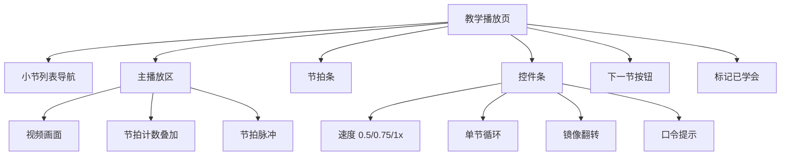

# 舞蹈教学网站 · 产品需求文档（PRD）—— 规划阶段

> 版本：v0.1（规划稿，不含实现代码）｜产品经理：许清楚｜阶段：仅规划，确认方向后再开发
> 团队：software-dance-teaching

---

## 0. 项目信息

- **Language**：中文（文档与产品交互均中文）
- **Programming Language / 技术栈**：前端 React + MUI + Tailwind CSS；后端 FastAPI（Python，负责音视频分析：beat 检测 / 8 拍分段 / 后续姿态识别）。本地可运行，不依赖重云服务。
- **Project Name**：`dance_teacher_web`（snake_case）
- **原始需求复述**：用户上传任意舞蹈视频（多为自己下载的教学/表演视频），系统基于视频节拍自动找出"一二三四五六七八"拍、按 8 拍切分整支舞；网站不只是"扒舞"，而是要**像资深舞室老师那样一小节一小节带练**（节拍标注、分段慢放、循环、正/背面视角切换等）。目标用户是看视频学不会的新手小白，只需上传、其余交给网站。分期：Phase 1 = 分段慢放教学 MVP；Phase 2 = 摄像头跟练打分。

---

## 1. 产品目标

**一句话定位**：把任意舞蹈视频，自动变成"舞室老师一小节一小节带练"的智能教学课——用户上传视频，剩下的交给网站。

**3 条核心成功指标（关键结果）**

| 指标 | 定义 / 目标值 |
|---|---|
| **指标1 · 处理时延与准确率** | 用户上传视频后，在本地算力下 ≤ 3 分钟（≤2 分钟短视频）得到"可教学的 8 拍分段 + 节拍标注"结果；分段抽检准确率 ≥ 90%。 |
| **指标2 · 学习完成度** | 新手在无真人老师情况下，单支舞"分段学习完成率"（已学会小节 / 总小节）≥ 70%；学习进度断点续学保存率 100%。 |
| **指标3 · 带练有效性** | 单小节"带练 → 学会 → 进入下一节"转化率 ≥ 60%（以循环次数、"已学会"标记衡量）。 |

---

## 2. 目标用户与画像

**核心人群**：18–35 岁、想自学舞蹈但"看视频学不会"的零基础 / 小白用户。

**用户特征**
- **动机**：学爱豆 / K-pop / 短视频热门舞蹈、聚会表演、健身塑形。
- **痛点**：视频太快、没有节拍提示、不知动作对错、没人带练、容易放弃。
- **设备（Phase1）**：笔记本 / 台式机为主，浏览器访问；Phase2 扩展到带摄像头的设备。
- **技术水平**：普通互联网用户，不接受复杂操作，期望"上传即教"。

**典型使用场景**
- **场景A（小美，22 岁）**：下载了一段 K-pop 舞蹈视频，反复看仍跟不上。上传到网站 → 系统按 8 拍拆成 12 个小节 → 她从第 1 节开始慢放 + 循环，跟着屏幕上的"1、2、3…8"口令练，学会后点"下一节"。
- **场景B（阿杰，28 岁）**：想学一支舞在公司年会表演。周末在家用电脑，把老师背面教学视频用"镜像翻转"当成正面示范，逐节攻克。
- **场景C（回归学习）**：上次学到第 6 节，关掉网页。下次打开自动回到第 6 节，继续带练。

---

## 3. 用户故事（≥8 条）

- **US-1 上传**：作为新手用户，我希望上传本地舞蹈视频（或粘贴视频链接），以便让网站帮我分析教学，而不必自己拆解。
- **US-2 beat 检测**：作为用户，我希望系统自动检测视频的节拍 / BPM，以便无需我手动打拍。
- **US-3 8 拍分段**：作为用户，我希望系统按"8 拍"把整支舞切成一个个小节，以便我能一小节一小节地学（像老师喊"预备，一二三四五六七八"）。
- **US-4 分段慢放**：作为学不会的新手，我希望每个小节能单独慢放（0.5x / 0.75x），以便看清动作细节。
- **US-5 分段循环**：作为新手，我希望某个小节可以无限循环播放，以便反复跟练直到学会再进下一节。
- **US-6 节拍数叠加**：作为被带练的用户，我希望播放时屏幕上有"1、2、3…8"的节拍数和脉冲提示，以便踩准节奏、像在舞室被老师数拍。
- **US-7 视角切换**：作为面对屏幕练习的用户，我希望能"镜像翻转 / 正背面切换"视频，以便老师看起来是面朝我教（舞室镜面效果），动作方向不反。
- **US-8 进度保存**：作为可能分多次学的用户，我希望系统自动保存学习进度（学到第几节、哪些标"已学会"），以便下次打开能断点续学。
- **US-9 小节标记学会**：作为用户，我希望能手动标记某小节"已学会 / 还需练"，以便掌握自己的进度并决定何时进入下一节。
- **US-10（Phase2）跟练打分**：作为想验证自己的用户，我希望打开摄像头对着跳，系统用姿态识别对比老师动作并给出反馈 / 评分，以便知道哪里跳错了、如何改进。

---

## 4. 需求池（P0 / P1 / P2）

### P0 —— Phase 1 MVP 必须

| 编号 | 描述 | 验收标准 |
|---|---|---|
| **P0-1** | 视频上传入口（本地文件 + 链接，见待确认） | 支持常见格式（mp4/webm/mov）；显示文件名、大小、上传进度；失败有提示与重试。 |
| **P0-2** | 后端 beat 检测与 8 拍分段 | FastAPI 分析音频提取 BPM / 节拍点；按 8 拍聚合为小节；返回每小节时间区间与节拍点列表。短视频处理 ≤ 3 分钟；分段抽检准确率 ≥ 90%。 |
| **P0-3** | 分析进度页 | 展示"解析中"状态与进度（排队 → 检测 beat → 分段 → 生成标注）；失败可重试。 |
| **P0-4** | 教学播放页 · 小节列表 | 左栏列出所有小节（1/8、2/8…），显示时长；点击跳转；当前节高亮。 |
| **P0-5** | 教学播放页 · 播放与慢放 | 主播放区支持 0.5x / 0.75x / 1x 速度切换；进度条可拖动。 |
| **P0-6** | 教学播放页 · 分段循环 | 可开启"单节循环"，播完当前节自动重播，直到关闭或点"下一节"。 |
| **P0-7** | 节拍数叠加显示 | 播放时按拍点在画面叠加"1…8"计数与视觉脉冲（踩拍提示），与音频 / 动作同步。 |
| **P0-8** | 视角切换（镜像 / 正背面） | 提供"镜像翻转"开关，使单角度视频呈镜面效果；若视频含正 / 背双机位则可选切换。默认镜像开。 |
| **P0-9** | 进度保存（本地） | 基于浏览器本地存储（localStorage / IndexedDB）保存每支视频学习进度与"已学会"标记；下次打开自动恢复。 |
| **P0-10** | 小节"已学会"标记 | 用户可标记小节为已学会 / 待练；列表与进度页反映状态。 |

### P1 —— Phase 1 增强 / Phase 2 前期

| 编号 | 描述 | 验收标准 |
|---|---|---|
| **P1-1** | 口令 / 语音提示 | 每拍可发声"一、二…八"或鼓点音效，强化带练感（可静音）。 |
| **P1-2** | 前奏 / 间奏智能跳过 | 后端识别无舞蹈段落（纯音乐 / 休息），标记并支持一键跳过。 |
| **P1-3** | 分段微调（手动编辑） | 用户可拖动边界微调小节起止，校正自动分段误差。 |
| **P1-4** | 多视频 / 我的课程列表 | 已分析视频以"课程卡片"聚合，可重开继续学。 |
| **P1-5** | Phase2 前期：摄像头接入与姿态识别原型 | FastAPI 接入姿态识别（MediaPipe / BlazePose 等），对单帧 / 短视频做骨骼关键点提取，输出与老师动作相似度打分（原型验证）。 |
| **P1-6** | 学习统计 | 展示已学小节数、累计练习时长、完成度百分比。 |

### P2 —— 远期

| 编号 | 描述 | 验收标准 |
|---|---|---|
| **P2-1** | 云端账户体系与跨设备同步 | 注册登录，进度云端保存，手机 / 电脑同步。 |
| **P2-2** | 社区 / 分享 | 生成"前后对比"短片并分享学习成果。 |
| **P2-3** | 老师示范库 / 官方课程 | 平台提供已分段好的精选课程，免上传即用。 |
| **P2-4** | AI 动作纠错细粒度反馈 | 不只打分，指出"第 3 拍右手抬太低"等自然语言反馈。 |
| **P2-5** | 移动端 App / 摄像头跟练适配 | 手机端实时跟练打分体验优化。 |

---

## 5. 竞品 / 参考产品扫描

| 产品 / 类型 | 做法 | 与我们的差异 |
|---|---|---|
| **YouTube / B 站慢放** | 播放器支持 0.25x 慢放、循环片段（需手动），无节拍标注。 | 我们自动 8 拍分段 + 节拍数叠加 + 带练节奏感，降低"自己拆解"门槛。 |
| **扒舞类 App（舞蹈啦、巧学等）** | 多为"动作拆解 / 镜面翻转 / 慢放"，少数做自动踩点。 | 我们强调"舞室老师带练"体验（口令 + 循环 + 逐节攻克），而非单纯工具。 |
| **姿态纠正类（STEEZY、Just Dance、健身镜）** | STEEZY 结构化课程 + 慢放；Just Dance / 健身镜靠游戏化 / 硬件做实时跟跳打分。 | 我们输入是**任意用户视频（UGC）**，不依赖官方课程库；Phase2 才做打分。 |
| **AI 健身 / 瑜伽跟练（Fitbod、AI 健身镜）** | 摄像头姿态识别 + 实时纠错。 | 我们 Phase1 不做摄像头，先解决"任意视频 → 可教学分段"，路径更轻、冷启动门槛低。 |
| **音频 beat 检测工具（librosa、Spleeter 等）** | 仅做音频分析 / 节拍提取，无教学闭环。 | 我们把它作为后端能力，封装进"教学产品"而非独立工具。 |

**结论**：市场缺少"上传任意舞蹈视频 → 自动按 8 拍拆成老师带练课"的轻量产品。我们 Phase1 用"自动分段 + 带练交互"切入，差异化明显、技术可行、冷启动容易。

---

## 6. UI 设计稿

### 6.1 上传页（Upload）

```
┌──────────────────────────────────────────┐
│  舞蹈老师 · 上传你的舞蹈视频                │
│                                            │
│   ┌────────────────────────────────────┐  │
│   │  📁 拖拽视频到此处 / 点击选择文件    │  │
│   │  支持 mp4 / webm / mov              │  │
│   └────────────────────────────────────┘  │
│   🔗 或粘贴视频链接（可选）                │
│   [ 开始分析 ]                             │
│   提示：上传后即由网站自动拆成 8 拍小节     │
└──────────────────────────────────────────┘
```

### 6.2 分析进度页（Analyzing）

```
┌──────────────────────────────────────────┐
│  正在为你拆解舞蹈…  ⏳ 62%                  │
│                                            │
│  ✓ 接收视频                                │
│  ⟳ 检测节拍 (BPM)…                         │
│  ○ 按 8 拍分段                             │
│  ○ 生成节拍标注                            │
│                                            │
│  （预计还需 ~1 分钟，完成后自动进入课堂）   │
└──────────────────────────────────────────┘
```

### 6.3 教学播放页（Classroom）—— 核心页面

```
┌────────────────────────────────────────────────────────┐
│  ← 返回      课程：K-pop xxx 舞蹈      进度 3/12 小节    │
├───────────────┬────────────────────────────────────────┤
│  小节列表      │   主播放区（视频）                      │
│  (8拍/节)     │   ┌──────────────────────────────────┐ │
│  ─────────     │   │      [ 视频画面 ]                 │ │
│ ① 1/8  ✓      │   │      节拍脉冲 ●●●●               │ │
│ ② 2/8  ✓      │   │      叠加 "3"  (踩拍提示)          │ │
│ ③ 3/8  ▶ 当前 │   │                                  │ │
│ ④ 4/8         │   └──────────────────────────────────┘ │
│ ⑤ 5/8         │   节拍条：▮▮▮●▮▮▮▮ (当前拍高亮)          │
│ ...           │                                        │
│ ⑫ 12/8        │   控件条：                              │
│               │   ⏮小节 | ▶/⏸ | ⏭小节                  │
│  [标记已学会✓] │   速度：0.5x 0.75x 1x                    │
│               │   🔁单节循环 [开/关]                     │
│               │   🪞镜像翻转 [开/关]                     │
│               │   🔈口令提示 [开/关]                     │
│               │                                        │
│               │   [ 下一节 → ]  （学会后进入）            │
└───────────────┴────────────────────────────────────────┘
```

**布局要点（核心）**：左栏"小节列表"提供全局导航与进度感（像老师黑板上的课程表）；右栏主播放区占主导，视频上叠加节拍计数与脉冲，模拟老师数拍；底部控件条把"慢放 / 循环 / 镜像 / 口令"四个带练核心动作做成一键开关；"下一节"按钮强化"逐节攻克"的教学节奏，而非一次性看完。

### 6.4 个人学习进度页（My Progress）

```
┌──────────────────────────────────────────┐
│  我的课程                                   │
│  ┌────────┐ ┌────────┐ ┌────────┐         │
│  │ K-pop  │ │ 街舞   │ │ 国风   │         │
│  │ 3/12 ✓ │ │ 8/8 ✓  │ │ 0/10   │         │
│  │ 继续学习│ │ 复习   │ │ 开始   │         │
│  └────────┘ └────────┘ └────────┘         │
│                                            │
│  统计：累计练习 4.2 小时 · 完成 2 支舞       │
└──────────────────────────────────────────┘
```

**课堂页信息架构（Mermaid）**



---

## 7. 待确认问题（含建议默认值）

1. **beat 检测不准时如何兜底？**
   - 建议默认值：提供"分段微调（P1-3）"让手动校正；若自动 BPM 置信度低，提示用户选择「按音乐自动 / 按固定 8 拍（如 120 BPM）/ 手动标第一拍」，降低完全失败风险。
2. **支持本地视频还是仅链接？**
   - 建议默认值：Phase1 同时支持「本地文件上传 + 链接」（链接走后端下载转码）。若带宽 / 版权顾虑大，可先仅本地文件。
3. **Phase2 是否需要账户体系？**
   - 建议默认值：Phase1 用本地存储即可（零注册门槛）；账户体系放入 P2（P2-1），待跟练打分需要跨设备 / 社交时再引入。
4. **"正 / 背面视角"在单角度视频下如何实现？**
   - 建议默认值：Phase1 用"镜像翻转"模拟镜面（大多数教学视频面向学员时本就需翻转）；若源视频含正 / 背双机位再提供切换（P0-8）。
5. **视频时长 / 大小上限？**
   - 建议默认值：Phase1 本地运行，限制单文件 ≤ 500MB、时长 ≤ 10 分钟，超出提示裁剪或分阶段。
6. **节拍叠加的"口令"用文字还是语音？**
   - 建议默认值：Phase1 先做文字 + 视觉脉冲（P0-7），语音作为 P1-1 增强。
7. **隐私 / 版权**：用户上传视频仅用于个人学习、不出境不外传（本地优先），需在上传页声明。

---

> 交付说明：本文档为规划稿，未包含任何实现代码。确认方向后，可据此转交架构师做技术方案与排期；Phase 1（MVP）以 P0 需求为准。
