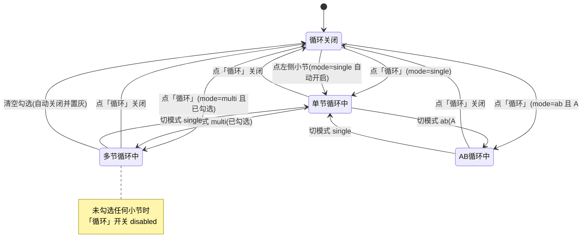

# 舞蹈老师·分段慢放教学 —— 产品需求文档（PRD）

> 版本：v2.0（循环体系重设计）
> 文档语言：中文
> 目标读者：架构师、实现工程师、外部 AI Review（Codex）
> 配套文档：[实现方式与踩坑记录（devlog）](./loop-redesign-devlog.md)

---

## 1. 一页纸概述

### 1.1 产品是什么

一个**纯浏览器端**的舞蹈教学辅助 Web 应用。用户上传一段舞蹈教学视频，应用在浏览器内完成音频解码与节拍检测，把视频按「8 拍 = 1 小节」自动切分，然后提供慢放、循环、镜像、数拍、对照练习等一整套「抠动作」工具。

**技术形态**：Vite + React + MUI + Tailwind CSS，zustand 管理状态，**零后端**。音频解码用 `AudioContext.decodeAudioData`，节拍检测用 `beat-detection`（纯 JS）跑在 WebWorker 里，进度持久化用 localStorage + IndexedDB。部署到 CloudStudio 静态托管，达成「零服务器、零终端、永久在线」。

### 1.2 产品目标

| # | 目标 | 衡量标准 |
|---|---|---|
| G1 | **零门槛、零运维**：用户打开网页即用，不装软件、不开终端、不依赖服务器 | 静态资源部署后可离线使用；无任何后端 API 调用 |
| G2 | **抠动作效率最大化**：把「找到那 8 拍 → 慢放 → 反复看」的循环压到 2 次点击以内 | 从打开课程到进入某小节的慢速循环 ≤ 2 次交互 |
| G3 | **循环体系零歧义**：任何时刻用户都能一眼看懂「现在循环开没开、循环的是哪一段」 | 控制栏仅一个循环开关；模式与作用对象在同一视觉区域内可读 |

### 1.3 本版本（v2.0）要解决的核心矛盾

当前循环功能有**两个容易混淆的入口**：

1. 控制栏一个按钮，文案在多选模式下曾写死为「单节循环」（已临时修过文案，但结构未改）；
2. 控制栏内嵌一个 `LoopPanel`，里面有 `单节 / 多选段落` 单选，**外加一份复制出来的段落勾选清单**——与左侧导航的小节列表完全重复。

用户吐槽原文（保留）：

> - 选了「多选段落」后按钮仍叫「单节循环」，不知道要不要按、按了会不会变单节。
> - 多节循环时，右边又搞了一份段落清单，和左边导航的小节列表重复，操作不直觉。

**v2.0 的答案**：控制栏只留**一个**叫「循环」的总开关 + **一组三选一**的模式切换（单节 / 多节 / AB）；多节模式下的段落选择**直接复用左侧小节列表**（列表项长出勾选框），彻底删除控制栏里那份重复清单。

---

## 2. 用户与使用场景

| 角色 | 描述 | 核心诉求 |
|---|---|---|
| **主要用户：舞蹈学习者** | 跟着网上/老师录的教学视频自学，需要反复看某几拍 | 快速定位 → 慢放 → 精准循环 |
| **次要用户：舞蹈老师** | 备课时拆解动作、给学生指出节拍 | 分段清晰、可标注已学会、可对照 |

**典型场景**：学员在客厅用笔记本打开网页 → 拖入手机录的一段 1 分钟教学视频 → 应用检测出 BPM 并切成 15 个小节 → 学员点第 7 小节，自动进入该节循环 → 把速度拖到 0.4x → 反复看 10 遍 → 标记「已学会」→ 勾选第 7、8、9 三节做连贯练习。

---

## 3. 用户故事

### 3.1 循环相关（本版本重点）

| ID | 用户故事 | 说明 |
|---|---|---|
| US-1 | 作为学习者，我想**点一下某个小节就让它单独循环起来**，这样我能反复抠这 8 拍的动作 | 「点哪节就循环哪节」，无需二次开关 |
| US-2 | 作为学习者，我想**勾选连续的几个小节让它们连起来循环**，这样我能练动作之间的衔接而不是碎片 | 连续勾选自动合并成一个大块 |
| US-3 | 作为学习者，我想**勾选不连续的几个小节轮流循环**，这样我能把散落在各处的难点集中攻克 | 非连续勾选各自成块、按顺序循环 |
| US-4 | 作为学习者，我想**自己框定 A→B 两个点循环**，这样我能抠一个跨小节边界的动作（比如第 3 节第 6 拍到第 4 节第 3 拍） | AB 拍点对齐 |
| US-5 | 作为学习者，我想**一眼看懂现在循环开没开、循环的是哪一段**，这样我不用靠试错判断按钮会做什么 | 单一总开关 + 明确模式态 + 作用对象可见 |
| US-6 | 作为学习者，我想在**没勾选任何小节时就知道「多节」模式还不能用**，而不是按下去没反应或行为意外 | 未勾选时开关置灰 + tooltip 引导 |
| US-7 | 作为学习者，我想**在同一个列表里既能跳转又能勾选**，不想在两份长得一样的列表间来回找 | 复用左侧小节列表 |

### 3.2 其他既有能力

| ID | 用户故事 |
|---|---|
| US-8 | 作为学习者，我想**把速度连续调到 0.25x~1.5x**，这样我能按动作难度精细控制 |
| US-9 | 作为学习者，我想**双击画面左右半边逐拍前后跳**，这样我能定格在某一拍看细节 |
| US-10 | 作为学习者，我想**把视频左右镜像**，这样我能像照镜子一样跟跳，不用做左右转换 |
| US-11 | 作为学习者，我想**单独控制拍点数字/圆点的镜像**，因为画面镜像后数字会反过来读不了 |
| US-12 | 作为学习者，我想**微调拍点计数的偏移**，因为自动检测的第一拍可能差半拍 |
| US-13 | 作为学习者，我想**左右分屏对照老师和我自己**，这样我能直接看出动作差异 |
| US-14 | 作为学习者，我想**有语音数拍**，这样我不看屏幕也知道到第几拍 |
| US-15 | 作为学习者，我想**标记某小节「已学会」**，这样我下次知道该练哪些 |
| US-16 | 作为学习者，我想**关掉网页再打开还能接着上次的进度**，这样我不用每次重新找位置 |

---

## 4. 功能全景（产品能力清单）

> 本节给出应用的完整能力版图，标注每项在本版本的状态。**循环体系（F03–F05、F12）是本版本的改造重点**，其余项目为「保持现状、不得回归」。

| # | 功能 | 状态 | 关键约束 |
|---|---|---|---|
| F01 | **零后端纯浏览器应用** | 保持 | 视频/音频全在浏览器内处理；可静态部署到 CloudStudio；零服务器、零终端、永久在线 |
| F02 | **按节拍自动切小节 + 连续慢放** | 保持 | 8 拍/节；速度滑条 0.25x~1.5x 连续可调，附 1x 快速复位 |
| F03 | **单节循环（padded）** | 改造入口，行为不变 | 循环播放头当前所在小节，**前后各加一拍**过渡 |
| F04 | **多选段落循环** | 改造入口，行为不变 | 连续勾选合并成一块并前后各加一拍；非连续勾选各自成块、顺序轮转 |
| F05 | **AB 自定义循环** | 改造入口，行为不变 | A/B 吸附到最近拍点；与单节循环互斥 |
| F06 | **双击左/右半屏跳拍** | 保持 | 左 = 前一拍，右 = 后一拍；**纯屏幕坐标，忽略镜像** |
| F07 | **视频镜像 / 拍子镜像双开关** | 保持 | 两个开关相互独立 |
| F08 | **节拍偏移校准** | 保持 | 拖动仅预览（draft），确认后才重锚网格；拖动期间不影响循环落点 |
| F09 | **对照练习（左右分屏）** | 保持 | 老师左 / 学员右；分屏期间循环引擎置为 inactive |
| F10 | **语音数拍** | 保持 | 中文 TTS，优先挑选自然中文音色 |
| F11 | **已学会标记 + 进度持久化** | 保持 | localStorage +（大结果）IndexedDB |
| F12 | **循环体系重设计** | **本版本新增** | 单一「循环」总开关 + 三选一模式 + 复用左侧列表勾选 |

---

## 5. 循环体系重设计（重点章节）

### 5.1 设计原则

1. **一个开关管开关，一组模式管形态**——「循环是否启用」与「循环哪一段」是两个正交概念，必须拆成两个控件，且**开关只有一个**。
2. **作用对象就地选择**——选哪些小节，就在展示小节的那个列表里选，不另起一份清单。
3. **不可用状态要提前告知**——多节模式未勾选时，开关置灰并给出 tooltip，而不是允许按下后行为意外。
4. **底层引擎零改动**——`useBeatSync` 的循环算法（padded loop / loop blocks / AB）已验证稳定，本次只改 UI 与 store 形态，在页面层做适配映射。

### 5.2 目标交互（文字描述）

**控制栏（改造后）**

- 只保留**一个**按钮，文案固定为「**循环**」（不再随模式改名），通过 `variant`（contained/outlined）表达开/关。
- 按钮**右侧紧邻**一组三选一切换（MUI ToggleButtonGroup 或 RadioGroup）：`单节 | 多节 | AB`。
- 按钮下方（或 tooltip 内）显示**一行状态摘要**，如「循环中 · 多节（第 3–5、8 节）」。
- **删除** `LoopPanel` 中那份段落勾选清单及其「全选/清空」按钮。
- AB 模式选中时，才在控制栏显示「设 A / 设 B / 清除」这一排入口（当前是常驻显示，改为按需显示）。

**左侧小节列表（改造后）**

- 默认（单节 / AB 模式）：与现在完全一致——纯跳转列表，**不显示勾选框**。
- 切到「多节」模式：每个列表项左侧**长出一个 Checkbox**，列表头部出现「全选 / 清空」小按钮（从 LoopPanel 迁移过来）。
- 勾选框与列表项文字**点击区域分离**：点勾选框 = 切换选中；点文字 = 跳转（详见待确认问题 Q1）。

### 5.3 交互稿（ASCII）

改造前（问题态）：

```
┌─ 左侧小节列表 ────┐  ┌─ 播放器 ───────────────────────────────┐
│ ▸ 1 / 15 小节     │  │                                        │
│ ▸ 2 / 15 小节     │  │            [video + beat overlay]      │
│ ▸ 3 / 15 小节  ✓  │  │                                        │
│ ▸ 4 / 15 小节     │  └────────────────────────────────────────┘
│ ...               │  ┌─ 控制栏 ───────────────────────────────┐
│                   │  │ 速度 ──●──── 1.00x [1x]                │
│                   │  │ [单节循环]  ← 文案写死，多选时也这样   │
│                   │  │ ┌ 循环方式 ○单节 ●多选段落 ─────────┐  │
│                   │  │ │ [全选][清空]                      │  │
│                   │  │ │ ☑ 第1节 (0:00–0:04)   ← 重复清单! │  │
│                   │  │ │ ☐ 第2节 (0:04–0:08)               │  │
│                   │  │ │ ☑ 第3节 (0:08–0:12)               │  │
│                   │  │ └───────────────────────────────────┘  │
│                   │  │ AB循环 [设A][设B] A:— B:—  ← 常驻     │
└───────────────────┘  └────────────────────────────────────────┘
```

改造后（目标态，多节模式）：

```
┌─ 左侧小节列表 ────────┐  ┌─ 播放器 ───────────────────────────┐
│ 小节列表（8 拍/节）   │  │                                    │
│ [全选] [清空]         │  │        [video + beat overlay]      │
│ ☑ 1 / 15 小节         │  │                                    │
│ ☑ 2 / 15 小节  已学会 │  └────────────────────────────────────┘
│ ☐ 3 / 15 小节         │  ┌─ 控制栏 ───────────────────────────┐
│ ☑ 5 / 15 小节         │  │ 速度 ──●──── 0.50x [1x]            │
│ ...                   │  │                                    │
│  ↑ 勾选框仅「多节」   │  │ [● 循环]  ( 单节 │ ●多节 │ AB )    │
│    模式下出现         │  │  循环中 · 多节（第 1–2、5 节）     │
│                       │  │                                    │
│                       │  │ [视频镜像][拍子镜像][口令][对照]   │
└───────────────────────┘  └────────────────────────────────────┘
```

改造后（AB 模式）：

```
┌─ 左侧小节列表 ────────┐  ┌─ 控制栏 ───────────────────────────┐
│ 小节列表（8 拍/节）   │  │ [○ 循环]  ( 单节 │ 多节 │ ●AB )    │
│ ▸ 1 / 15 小节         │  │ [设 A][设 B][清除]                 │
│ ▸ 2 / 15 小节         │  │ A: 小节3·拍6 (12.40s)              │
│ ▸ 3 / 15 小节         │  │ B: 小节4·拍3 (14.85s)              │
│  ↑ 无勾选框，纯跳转   │  │  ↑ 仅 AB 模式显示                  │
└───────────────────────┘  └────────────────────────────────────┘
```

### 5.4 状态机（Mermaid）



### 5.5 模式切换行为矩阵

| 当前模式 | 切到 | `loopEnabled` 处理 | 引擎侧效果 |
|---|---|---|---|
| single | multi（已勾选） | 保持原值 | 从「循环当前节」切到「循环勾选块」，cursor 锚到播放头所在块 |
| single | multi（未勾选） | **强制置 false 并置灰** | 引擎不循环（避免降级成单节造成「模式与行为不符」） |
| single | ab（A<B 已配置） | 保持原值 | AB 分支优先接管 |
| single | ab（AB 未配置） | **强制置 false 并置灰** | tooltip：「请先设 A、B 点」 |
| multi | single | 保持原值 | 循环目标锚到播放头当前所在节 |
| ab | single | 保持原值 | AB 停用，单节接管 |
| 任意 | 任意 | — | **切模式不改变播放位置，不打断播放** |

---

## 6. 状态模型草图

### 6.1 目标 store 形态（`useLessonStore`）

```ts
/** 循环形态：三选一，互斥 */
export type LoopMode = 'single' | 'multi' | 'ab'

export interface LessonState {
  // ===== 循环体系（v2.0 重设计）=====
  /** 循环总开关：唯一决定「循环是否启用」。控制栏那个叫「循环」的按钮直接绑它。 */
  loopEnabled: boolean
  /** 循环形态。'ab' 为新增值（旧类型只有 'single' | 'multi'）。 */
  loopMode: LoopMode
  /** 多节模式下被勾选的小节 index（1-based，对应 Segment.index），升序去重。 */
  loopSegmentIds: number[]
  /** AB 循环端点。注意：enabled 字段降级为「AB 是否已配置好可用」，
   *  真正是否在跑由 loopEnabled && loopMode==='ab' 决定。 */
  abLoop: ABLoop | null
  /** 循环次数上限，null = 无限。行为不变。 */
  loopCount: number | null

  // ===== 其余字段保持不变 =====
  currentSegment: number
  playbackRate: number
  mirror: boolean
  beatMirror: boolean
  voiceEnabled: boolean
  beatOffset: number
  draftBeatOffset: number
  learnedSegments: number[]

  // ===== 循环相关 action =====
  setLoopEnabled: (b: boolean) => void
  toggleLoopEnabled: () => void
  setLoopMode: (m: LoopMode) => void
  toggleLoopSegmentId: (id: number) => void
  setLoopSegmentIds: (ids: number[]) => void
  setABLoop: (v: ABLoop | null) => void
}
```

### 6.2 派生量（不入 store，由 selector / useMemo 计算）

| 派生量 | 计算式 | 用途 |
|---|---|---|
| `canEnableLoop` | `mode==='single'` → `true`；`mode==='multi'` → `loopSegmentIds.length > 0`；`mode==='ab'` → `abLoop != null && abLoop.aTime < abLoop.bTime` | 「循环」按钮是否可点 |
| `isLooping` | `loopEnabled && canEnableLoop` | 引擎是否应该跑循环 |
| `loopSummary` | 按模式拼字符串 | 控制栏状态摘要文案 |
| `showCheckboxes` | `loopMode === 'multi'` | 左侧列表是否显示勾选框 |

### 6.3 与引擎（`useBeatSync`）的适配映射

> **关键设计**：`useBeatSync` **不改签名、不改算法**。在 `LessonPage` 做一层映射，把新的三态模型翻译成引擎现有的三个入参。这样「底层能力保留且行为不变」是结构性保证，而不是靠回归测试碰运气。

```ts
// LessonPage 内的适配层
const canEnableLoop =
  loopMode === 'single' ? true
  : loopMode === 'multi' ? loopSegmentIds.length > 0
  : !!(abLoop && abLoop.aTime < abLoop.bTime)

const isLooping = loopEnabled && canEnableLoop

// 引擎入参 1：loopSegment（引擎里的「单节/多节循环总开关」）
const engineLoopSegment = isLooping && loopMode !== 'ab'

// 引擎入参 2：loopMode（引擎只认 'single' | 'multi'）
const engineLoopMode: 'single' | 'multi' = loopMode === 'multi' ? 'multi' : 'single'

// 引擎入参 3：abLoop（引擎靠 abLoop.enabled 判断 AB 分支优先）
const engineAbLoop = abLoop
  ? { ...abLoop, enabled: isLooping && loopMode === 'ab' }
  : null

useBeatSync(
  videoRef, offsetSegments,
  engineLoopSegment,               // ← 原 loopSegment
  draftBeatOffset - beatOffset,
  beatDuration,
  (i) => setSegment(i),
  engineAbLoop,                    // ← 原 abLoop
  loopCount,
  engineLoopMode,                  // ← 原 loopMode
  loopSegmentIds,
  !compareOpen,
  forceLoopTargetRef,
)
```

**映射的三条不变量**：

1. `loopMode !== 'ab'` 时 `engineAbLoop.enabled === false` → 引擎永远走单节/多节分支，AB 不会抢占。
2. `loopMode === 'ab'` 时 `engineLoopSegment === false` → 引擎的单节/多节分支不执行，AB 独占。**互斥由映射层保证，不再依赖 store setter 的副作用。**
3. `loopMode === 'multi'` 且未勾选时 `isLooping === false` → 引擎完全不循环，**不会**触发「空选降级成单节」这条老路径（见 devlog 坑 #4：老路径保留在引擎里作为兜底，但新 UI 下不可达）。

### 6.4 旧字段 → 新字段迁移关系

| 旧字段 | 新字段 | 迁移公式 | 说明 |
|---|---|---|---|
| `loopSegment: boolean` | `loopEnabled` + `loopMode` | `loopSegment === (loopEnabled && loopMode === 'single')` | 旧 `loopSegment` 语义混合了「开关」与「单节形态」两件事，这正是本次要拆开的根因 |
| `loopMode: 'single'\|'multi'` | `loopMode: 'single'\|'multi'\|'ab'` | 值域扩展，旧值原样保留 | 新增 `'ab'` |
| `loopSegmentIds: number[]` | 不变 | — | 仅使用场景从 LoopPanel 换成 SegmentList |
| `abLoop.enabled` | `loopEnabled && loopMode==='ab'` | 反向：`enabled === true` ⇒ `loopMode='ab', loopEnabled=true` | `abLoop.enabled` 在 store 中降级为「已配置」标记，运行态由映射层合成 |

**持久化迁移（`useLocalProgress.LessonProgress`）**

现状：`LessonProgress` **只持久化了 `loopSegment`**，没有 `loopMode` / `loopSegmentIds`（已核对 `frontend/src/hooks/useLocalProgress.ts`）。

```ts
// 新 schema（全部可选，缺失时走 hydrate 兜底）
export interface LessonProgress {
  // ... 既有字段
  loopSegment?: boolean          // 旧字段，仅用于向后兼容读取，不再写入
  loopEnabled?: boolean          // 新
  loopMode?: 'single' | 'multi' | 'ab'   // 新
  loopSegmentIds?: number[]      // 新
  abLoop?: ABLoop | null
}
```

hydrate 兜底逻辑：

```ts
const loopEnabled = p.loopEnabled ?? p.loopSegment ?? false
const loopMode = p.loopMode ?? (p.abLoop?.enabled ? 'ab' : 'single')
const loopSegmentIds = p.loopSegmentIds ?? []
```

> **注意**：旧存档里若 `abLoop.enabled === true` 且 `loopSegment === false`，迁移后应得到 `loopEnabled=true, loopMode='ab'`——上面的兜底式已覆盖该情形。

---

## 7. 需求池（P0 / P1 / P2）

> P0 = 必须有（本版本不做就不算完成）；P1 = 应该有；P2 = 锦上添花。
> 每条附**可执行的验收标准**，Codex 可据此直接写/改测试。

### 7.1 P0（必须）

| ID | 需求 | 验收标准 |
|---|---|---|
| **P0-1** | 控制栏只保留**一个**循环按钮，文案固定为「循环」 | 1) 渲染 ControlBar，DOM 中匹配 `/循环/` 的**按钮**有且仅有 1 个；2) 在 single/multi/ab 三种模式下，该按钮可见文案**恒为**「循环」，不出现「单节循环」「多选循环 (N)」等字样；3) 开启时 `variant="contained"`，关闭时 `variant="outlined"` |
| **P0-2** | 该按钮**只负责开关**，不改变模式 | 点击按钮前后 `useLessonStore.getState().loopMode` 不变 |
| **P0-3** | 三选一模式切换（单节 / 多节 / AB），互斥单选 | 1) 控制栏存在一组三个选项的切换控件；2) 任意时刻有且仅有一个选中；3) 点击某项后 `loopMode` 等于对应值 |
| **P0-4** | **多节模式且 `loopSegmentIds` 为空时，「循环」开关置灰** | 1) `loopMode='multi', loopSegmentIds=[]` 时按钮 `disabled === true`；2) tooltip 文案含「请先勾选要循环的段落」；3) 勾选任意一节后按钮立即变为可用 |
| **P0-5** | **删除控制栏里那份重复的段落勾选清单** | 1) 代码库中不再存在渲染段落清单的 `LoopPanel`（组件删除或改写为不含清单）；2) `loopMode='multi'` 时，DOM 中形如「第 N 节 (mm:ss – mm:ss)」的勾选项**数量为 0**；3) 全局搜索 `LoopPanel` 无残留引用 |
| **P0-6** | **左侧小节列表在「多节」模式下显示勾选框** | 1) `loopMode='multi'` 时，SegmentList 每一项渲染一个 `checkbox` role 元素；2) 勾选后 `loopSegmentIds` 包含该 index；3) 再次点击取消，`loopSegmentIds` 移除该 index |
| **P0-7** | **左侧小节列表在「单节」/「AB」模式下不显示勾选框** | `loopMode='single'` 或 `'ab'` 时，SegmentList 内 `role="checkbox"` 元素数量为 0；列表点击行为与改造前完全一致（跳转） |
| **P0-8** | **单节循环行为不变**：循环播放头当前所在小节，含前后各一拍过渡 | 现有 `computePaddedLoopBounds` 相关测试（`useBeatSync.test.tsx` 等）**全部保持通过且不修改断言** |
| **P0-9** | **「点哪节就循环哪节」行为不变** | 单节模式下点击左侧任一小节：1) 播放头跳到该节起点；2) `loopEnabled` 自动变 `true`；3) 循环目标为被点击的那一节（`qa_lessonPage_clickSegmentAutoLoop.test.tsx` 等价断言通过） |
| **P0-10** | **多节循环行为不变**：连续合并 + 前后各一拍；非连续各自成块顺序轮转 | `buildLoopBlocks` / `computePaddedLoopBoundsForBlock` 的现有单测（`useBeatSync.multi.test.tsx`）**全部保持通过且不修改断言** |
| **P0-11** | **AB 循环行为不变**：拍点对齐，与单节循环互斥 | 1) `abLoop.test.tsx` 现有断言通过；2) 切到 AB 模式并启用后，引擎不再执行单节/多节回跳；3) 切回 single 后 AB 立即停止 |
| **P0-12** | **双击左/右半屏跳拍行为不变** | 左半屏 → 前一拍，右半屏 → 后一拍；`mirror=true` 与 `mirror=false` 下**方向一致**（`VideoPlayer.dotJump.test.tsx` / `useBeatSync.step.test.tsx` 等价断言通过） |
| **P0-13** | 状态字段完成迁移，旧存档可正常 hydrate | 1) store 暴露 `loopEnabled` / `loopMode('single'\|'multi'\|'ab')` / `loopSegmentIds` / `abLoop`；2) 读入只含旧 `loopSegment: true` 的存档，hydrate 后为 `loopEnabled=true, loopMode='single'`；3) 读入 `abLoop.enabled=true` 的旧存档，hydrate 后为 `loopEnabled=true, loopMode='ab'` |
| **P0-14** | 模式切换不打断播放、不改变播放位置 | 播放中切换 single↔multi↔ab：`video.currentTime` 不被程序性改写，`paused` 状态不变 |

### 7.2 P1（应该）

| ID | 需求 | 验收标准 |
|---|---|---|
| **P1-1** | 控制栏显示**循环状态摘要** | single：「循环中 · 单节（第 N 节）」；multi：「循环中 · 多节（第 1–2、5 节）」（连续区间用 `–` 折叠）；ab：「循环中 · AB（小节3·拍6 → 小节4·拍3）」；关闭时显示「循环已关闭」 |
| **P1-2** | 左侧列表在多节模式下提供「全选 / 清空」 | 1) 仅 `loopMode='multi'` 时出现；2) 「全选」后 `loopSegmentIds` 等于全部 index；3) 「清空」后为 `[]`，且「循环」开关随即置灰（联动 P0-4） |
| **P1-3** | 多节模式下**被勾选的小节有视觉强调** | 被勾选项有区别于普通项的背景/边框；当前播放小节的高亮与「被勾选」两种状态可同时区分 |
| **P1-4** | AB 模式下才显示「设 A / 设 B / 清除」入口 | 1) `loopMode !== 'ab'` 时这组按钮不在 DOM 中；2) 切到 AB 模式后出现；3) A/B 未配置完整（`aTime >= bTime`）时「循环」开关置灰，tooltip 提示「请先设 A、B（A 须早于 B）」 |
| **P1-5** | 清空勾选时自动关闭循环 | `loopMode='multi'` 且 `loopEnabled=true` 时执行「清空」→ `loopEnabled` 自动变 `false`（避免留下「开着但没得循环」的中间态） |
| **P1-6** | 多节模式下点击小节的行为明确且一致 | 依 Q1 定论实现；无论定论为何，**行为必须与视觉提示一致**（如可跳转则整行有 hover 态） |
| **P1-7** | 循环相关状态纳入持久化 | `loopEnabled` / `loopMode` / `loopSegmentIds` 写入 `LessonProgress`，刷新页面后恢复 |

### 7.3 P2（可选）

| ID | 需求 | 验收标准 |
|---|---|---|
| **P2-1** | 键盘快捷键：`L` 切换循环、`1/2/3` 切换模式 | 焦点不在输入框时生效 |
| **P2-2** | 多节模式支持 Shift 连选 | 点第 3 节后 Shift+点第 7 节，勾选 3–7 全部 |
| **P2-3** | 循环次数上限 UI 暴露 | store 已有 `loopCount`，但当前无 UI；补一个「循环 N 次后继续播放」的选择器 |
| **P2-4** | 循环块在进度条上可视化 | 在播放器进度条上用色块标出当前循环区间 |

---

## 8. 待确认问题清单（需与用户 / Codex 对齐）

| # | 问题 | 选项 | PM 倾向 | 影响面 |
|---|---|---|---|---|
| **Q1** | **多节模式下点击小节文字，是「跳转」还是「切换勾选」？** | A) 点文字=跳转，点勾选框=勾选（区域分离）<br>B) 点整行=切换勾选，跳转只能靠双击/其他入口<br>C) 点文字=跳转**且**同时勾选 | **A**——与单节模式下的肌肉记忆一致，且勾选框本身就是明确的可点区域 | SegmentList 事件绑定；P1-6 验收 |
| **Q2** | **AB 模式的「设 A / 设 B」入口放哪？** | A) 控制栏（仅 AB 模式显示）<br>B) 左侧列表上方<br>C) 播放器进度条上直接拖两个把手 | **A**——A/B 是「基于当前播放位置」的操作，离播放控件近更合理；C 是 P2 增强 | ControlBar 布局；P1-4 |
| **Q3** | **切到「多节」但未勾选时，是否自动把播放头当前所在小节勾上？** | A) 不自动勾，开关置灰（当前 P0-4 写法）<br>B) 自动勾选当前小节，开关立即可用 | **A**——自动勾选属于「替用户做决定」，且会让「置灰 → 引导勾选」的教学意图失效 | P0-4 |
| **Q4** | **单节模式下点小节自动开启循环，这个行为在 multi/ab 模式下要不要也有对应逻辑？** | A) 保持现状：仅 single 自动开启，multi/ab 下点击只跳转<br>B) 三种模式都不自动开启，统一靠总开关 | **A**——B 虽然更"正交"，但会破坏用户已经习惯的「点哪节循环哪节」（P0-9 明确要求保留） | LessonPage.goToSegment |
| **Q5** | **`abLoop.enabled` 字段是否保留？** | A) 保留但降级为「已配置」标记（本 PRD 6.3 方案）<br>B) 彻底删除，AB 是否运行完全由 `loopEnabled+loopMode` 决定，端点只存 `aTime/bTime` | **B 更干净，但 A 改动小**。倾向先 A 落地、后续清理 | store / 持久化 schema / abLoop.test |
| **Q6** | **切模式时，之前模式的配置是否保留？**（如从 multi 切到 single 再切回 multi，勾选还在吗） | A) 保留（`loopSegmentIds` / `abLoop` 各自独立留存）<br>B) 切走即清空 | **A**——用户往往是「试一下单节，再切回多节」 | store setLoopMode |
| **Q7** | **多节模式下，被勾选小节的「已学会」Chip 与勾选框是否会挤在一行？** | A) 勾选框在左、Chip 在右，窄屏时 Chip 换行<br>B) 多节模式下隐藏「已学会」Chip | **A** | SegmentList 布局；移动端适配 |
| **Q8** | **`LoopPanel` 组件是删除还是保留空壳？** | A) 直接删除文件 + 删除 `LoopPanel.test.tsx`<br>B) 保留文件但清空清单渲染 | **A**——保留空壳会给后续 Review 造成噪声 | 需同步处理 `frontend/tests/LoopPanel.test.tsx` |

---

## 9. 受影响文件与测试清单（供实现参考）

> 已核对 `frontend/src/` 与 `frontend/tests/` 实际内容。

### 9.1 需要改动的源文件

| 文件 | 改动性质 |
|---|---|
| `frontend/src/store/lessonStore.ts` | **重构**：`loopSegment` → `loopEnabled`；`LoopMode` 值域加 `'ab'`；新增 `setLoopEnabled` / `toggleLoopEnabled`；移除 setter 里的互斥副作用（改由映射层保证） |
| `frontend/src/components/ControlBar.tsx` | **重构**：单一「循环」按钮 + 三选一模式组 + 状态摘要；移除 `<LoopPanel />`；AB 区改为仅 AB 模式显示 |
| `frontend/src/components/LoopPanel.tsx` | **删除**（见 Q8） |
| `frontend/src/components/SegmentList.tsx` | **增强**：新增 `selectable` / `selectedIds` / `onToggleSelect` props；多节模式渲染 Checkbox 与「全选/清空」 |
| `frontend/src/pages/LessonPage.tsx` | **新增适配层**（6.3）；把新 props 传给 SegmentList；`goToSegment` 内的 `loopMode === 'single'` 判断保持 |
| `frontend/src/hooks/useLocalProgress.ts` | **schema 扩展 + hydrate 兜底**（6.4） |
| `frontend/src/hooks/useBeatSync.ts` | **不改动**（这是本设计的核心保障） |

### 9.2 需要新增/更新的测试

| 测试文件 | 处理方式 |
|---|---|
| `frontend/tests/LoopPanel.test.tsx` | **删除**（组件已删） |
| `frontend/tests/ControlBar.loopButton.test.tsx` | **重写**：断言只有一个「循环」按钮、文案恒定、三模式切换、多节空选置灰（P0-1~4） |
| `frontend/tests/qa_lessonPage_clickSegmentAutoLoop.test.tsx` | **适配**：`loopSegment` → `loopEnabled`，断言语义不变（P0-9） |
| `frontend/tests/lessonStore.test.ts` | **适配 + 新增**：迁移公式、模式切换矩阵（P0-13） |
| `frontend/tests/abLoop.test.tsx` | **适配**：AB 启用路径改为 `loopMode='ab' + loopEnabled=true`（P0-11） |
| `frontend/tests/useBeatSync.*.test.tsx` | **不改断言**，仅在入参变化时适配调用方（P0-8/10/12 的护栏） |
| **新增** `SegmentList.select.test.tsx` | 多节模式勾选框出现/消失、勾选联动 store（P0-6/7） |
| **新增** `localProgress.loopMigration.test.ts` | 旧存档 hydrate 迁移（P0-13） |

---

## 10. 非目标（本版本明确不做）

1. 不引入任何后端/服务端能力。
2. 不改动 `useBeatSync` 的循环算法本身（padded 计算、block 合并、AB 判定、竞态修复逻辑全部原样保留）。
3. 不改动节拍检测管线（`beat-detection` + WebWorker + grid-only 兜底）。
4. 不做循环区间的进度条可视化（列为 P2-4）。
5. 不做移动端专属布局重构（仅保证现有响应式不劣化）。

---

## 附录 A：实现方式与踩坑记录

完整内容见配套文档 **[`loop-redesign-devlog.md`](./loop-redesign-devlog.md)**，其中记录了：

- BPM 检测为何放弃 aubiojs / aubio.wasm、改用 `beat-detection` 的完整决策链
- 单节循环「卡在当前小节」竞态的成因与 `forceLoopTargetRef` 修复
- 「点哪节就循环哪节」的实现路径
- 多选段落空选的引擎降级行为
- 双击跳拍的镜像方向 bug 与修复原则
- 循环按钮文案 bug（本次二次修复）
- AB 与单节循环互斥的 store 副作用
- 节拍偏移「草稿 / 确认」双值设计
- 测试 flaky 说明（`compareMode` elapsed badge）
- 状态字段迁移对照

> **给 Codex 的提示**：Review 本 PRD 时请重点核对第 6.3 节的适配层映射是否真的能让 `useBeatSync` 保持零改动；如果发现某条既有行为无法通过映射保留，请在 Q1–Q8 之外新增开放问题，不要直接改引擎。


