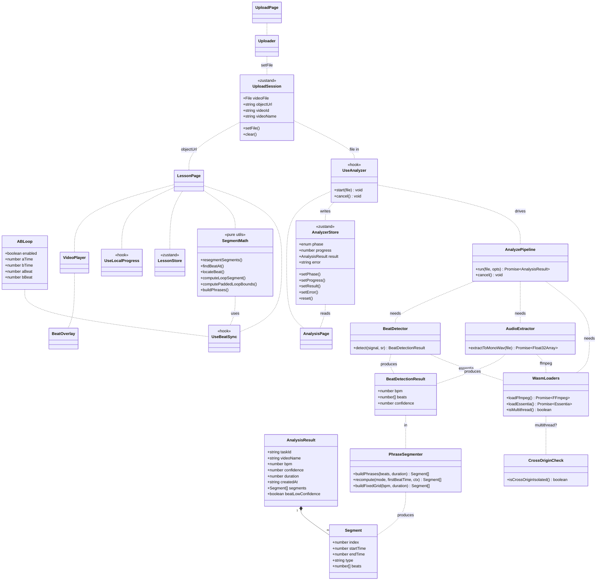
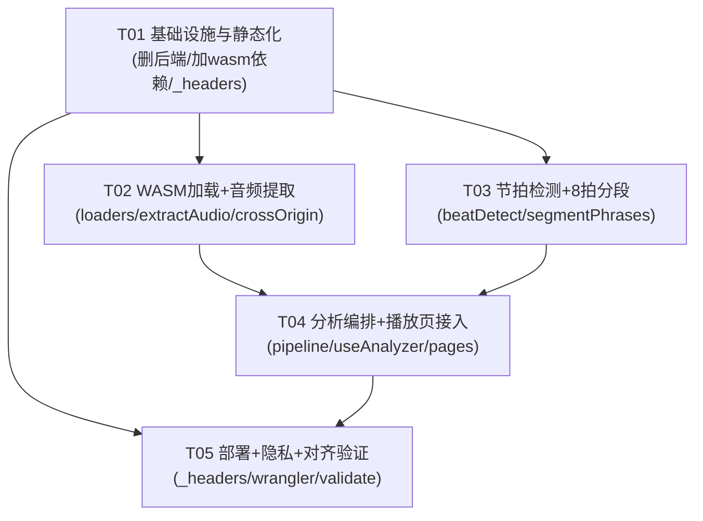

# 舞蹈老师 · 前端化架构设计 + 任务分解（纯前端静态 SPA）

> 版本：v0.1（架构稿）｜架构师：高见远（Bob/Gao）｜团队：software-frontendize
> 基线 PRD：`docs/frontendize-prd.md`（v0.2 增量）
> 目标：移除 Python 后端，把"音轨提取 + 节拍/BPM 检测"全部搬进浏览器，纯静态构建并免费部署到 Cloudflare Pages。

---

## 1. 实现方案与框架选型

### 1.1 技术难点

| 难点 | 说明 |
|---|---|
| 浏览器内音轨提取 | 视频文件不能直接拿去跑音频分析，需先抽离音频轨并转为分析可用的单声道 PCM。 |
| 浏览器内节拍/BPM 检测 | 原 librosa `beat_track` 在 Python 端完成；前端需等价 WASM 实现，且数值要对齐。 |
| WASM 体积与加载 | ffmpeg.wasm core ~30MB+、essentia wasm 数 MB，需懒加载 + 进度 + 缓存。 |
| 多线程依赖 | ffmpeg.wasm 多线程版依赖 `SharedArrayBuffer`，需跨源隔离（COOP/COEP）。 |
| 纯静态部署 | 无服务端运行时，视频仅本地处理，所有状态机/进度都落在前端。 |

### 1.2 框架与库选型（确认）

| 层 | 选型 | 理由 |
|---|---|---|
| 构建 | **Vite 5**（`vite build` → 纯静态 `dist`） | 已在使用，产物零运行时、可直接托管 Cloudflare Pages。 |
| UI | **React 18 + MUI 5 + Tailwind 3** | 沿用现有代码，交互不动。 |
| 状态 | **zustand 4** | 沿用；新增 `analysisStore` / `uploadSession`。 |
| 音轨提取 | **@ffmpeg/ffmpeg 0.12 + @ffmpeg/core(-mt)** | 浏览器内 ffmpeg.wasm，从视频抽音频。 |
| 节拍检测 | **essentia.js**（Essentia WASM） | 提供 `RhythmExtractor2013`，一次调用得 BPM + beats + confidence。 |
| 路由 | **react-router-dom 6** | 沿用 `/ /analyze/:id /lesson/:id /progress`。 |

架构模式：**单向数据流 + 状态机**。分析过程是一个显式有限状态机（`phase` 枚举），由 `AnalyzePipeline`（纯编排，无 React）驱动，`useAnalyzer` 把结果写入 `AnalyzerStore`，页面只读 store。播放交互层（LessonPage / useBeatSync）完全复用，仅把"数据来源"从后端 API 换成浏览器内生成的对象。

### 1.3 Cloudflare Pages 部署与 COOP/COEP

- **构建**：`vite build` → `dist/`（HTML/CSS/JS/WASM/worker 资源全静态）。
- **输出目录**：`dist`；构建命令 `npm run build`。
- **跨源隔离响应头**：在 `public/_headers` 声明（Vite 自动拷贝到 dist 根），对 `/*` 设置：
  ```
  /*
    Cross-Origin-Opener-Policy: same-origin
    Cross-Origin-Embedder-Policy: require-corp
  ```
  设置后页面变为 *cross-origin isolated*，`SharedArrayBuffer` 可用 → 启用 ffmpeg.wasm **多线程**核心提速。
- **WASM 同域托管**：ffmpeg core 与 essentia wasm 经 `scripts/copy-wasm.mjs` 拷贝到 `public/wasm/`，构建后位于 `dist/wasm/`，**同源**加载，天然满足 COEP `require-corp`（同源资源无需额外 CORP 头）。
- **控制台兜底**：若 `_headers` 不生效，可在 Cloudflare Pages 控制台 "Settings → Headers" 手动加这两条；架构以 `_headers` 为单一可信来源。

### 1.4 SharedArrayBuffer 不可用时的单线程降级

`WasmLoaders.isMultithread()` 在运行时检测：

```ts
const MT = typeof SharedArrayBuffer !== 'undefined' && self.crossOriginIsolated === true
```

- `MT === true` → 加载 `@ffmpeg/core-mt`（需 `coreURL`+`wasmURL`+`workerURL`），多线程提速。
- `MT === false` → 加载 `@ffmpeg/core`（单线程，`coreURL`+`wasmURL`），**更慢但兼容**（覆盖未配 COOP/COEP 的静态宿主、iOS Safari 等）。
- essentia.js 为单线程 WASM，两种情况下均正常，不受 SAB 影响。

> 设计约定：降级对用户透明，仅在「加载引擎」阶段多耗时间，最终分段质量一致。

---

## 2. 文件列表（改造后纯前端项目结构）

图例：✅ 复用 | 🆕 新增 | 🗑️ 删除 | ✏️ 改造

```
dance-teacher-frontend/                (原 frontend/ 根，建议重命名为项目根)
├── public/
│   ├── _headers                       🆕  Cloudflare Pages COOP/COEP 响应头
│   ├── favicon.svg                    ✅ 沿用
│   └── wasm/                          🆕  自托管 WASM（copy-wasm 生成）
│       ├── ffmpeg/ffmpeg-core.js      🆕  @ffmpeg/core(-mt) 核心
│       ├── ffmpeg/ffmpeg-core.wasm
│       ├── ffmpeg/ffmpeg-core.worker.js   (仅 mt)
│       └── essentia/essentia.wasm     🆕  essentia.js WASM 核心
├── scripts/
│   └── copy-wasm.mjs                  🆕  构建前把 node_modules 的 wasm 拷到 public/wasm
├── src/
│   ├── main.tsx                       ✅ 入口（不变）
│   ├── App.tsx                        ✅ 路由（不变）
│   ├── index.css                      ✅ 不变
│   ├── api/
│   │   └── client.ts                  🗑️ 删除（全部 axios 后端调用）
│   ├── types/
│   │   ├── api.ts                     ✏️ 保留 Segment/ABLoop/AnalysisResult；移除 TaskStatus 后端语义，新增本地分析类型
│   │   └── audio.ts                   🆕 BeatDetectionResult 等原始检测输出类型
│   ├── wasm/
│   │   └── loaders.ts                 🆕 加载/缓存 ffmpeg + essentia，多线程探测
│   ├── audio/
│   │   ├── extractAudio.ts           🆕 ffmpeg.wasm 抽音轨 → 单声道 Float32Array(44.1k)
│   │   ├── beatDetect.ts             🆕 essentia.js RhythmExtractor2013 → {bpm,beats,confidence}
│   │   └── segmentPhrases.ts         🆕 beats → 8拍 Segment[]；recompute 兜底（auto/fixed120/manual）
│   ├── analysis/
│   │   ├── analyzePipeline.ts         🆕 编排：加载→抽音→检测→分段→AnalysisResult；可取消
│   │   ├── useAnalyzer.ts             🆕 React hook，桥接 pipeline 与 store
│   │   └── crossOrigin.ts            🆕 跨源隔离/多线程能力检测（供 loaders 使用）
│   ├── store/
│   │   ├── lessonStore.ts            ✅ 沿用（播放状态机）
│   │   ├── analysisStore.ts          🆕 分析状态机（phase/progress/result/error/cancel）
│   │   └── uploadSession.ts          🆕 当前会话 File + objectUrl + videoId（跨页面传递）
│   ├── hooks/
│   │   ├── useBeatSync.ts             ✅ 沿用（节拍同步引擎，纯函数核心）
│   │   ├── useLocalProgress.ts        ✅ 沿用（localStorage/IndexedDB 进度）
│   │   ├── useVideoControls.ts        ✅ 沿用
│   │   ├── usePlayPauseSync.ts        ✅ 沿用
│   │   └── useAnalysisPolling.ts      🗑️ 删除（后端轮询）
│   ├── utils/
│   │   ├── segmentMath.ts             ✏️ 沿用并扩展（新增 buildPhrases 纯函数）
│   │   ├── format.ts                  ✅ 沿用
│   │   └── voice.ts                   ✅ 沿用
│   ├── components/
│   │   ├── Uploader.tsx               ✏️ 移除 axios/http 与 url 链接（P0 仅本地文件），改调 uploadSession
│   │   ├── VideoPlayer.tsx            ✏️ src 由后端 `/video/:id` 改为本地 objectUrl
│   │   ├── BeatOverlay.tsx            ✅ 沿用
│   │   ├── SegmentList.tsx            ✅ 沿用
│   │   ├── ControlBar.tsx             ✅ 沿用
│   │   └── ProgressHeader.tsx         ✅ 沿用
│   └── pages/
│       ├── UploadPage.tsx             ✏️ 移除 warmup()；加隐私声明文案
│       ├── AnalysisPage.tsx           ✏️ 移除轮询，改读 analysisStore 状态机 + 进度
│       ├── LessonPage.tsx             ✏️ getResult→本地 store；videoSrc→objectUrl；recompute→本地
│       └── ProgressPage.tsx           ✅ 沿用（本就本地索引）
├── vite.config.ts                     ✏️ 删除 /api proxy；保留 react 插件（wasm/worker 由 ?url 处理）
├── package.json                       ✏️ 删 axios；加 @ffmpeg/ffmpeg、@ffmpeg/util、@ffmpeg/core、@ffmpeg/core-mt、essentia.js；加 copy-wasm 脚本
├── index.html                         ✅ 不变（隐私文案放 UploadPage 内）
├── tsconfig*.json                     ✅ 不变
├── tailwind.config.js / postcss.config.js ✅ 不变
└── (backend/)                         🗑️ 整体删除（FastAPI + librosa 不再需要）
```

---

## 3. 数据结构与模块划分



**模块职责**
- **上传 / 会话**：`Uploader` → `UploadSession`（持有 `File` 与 `URL.createObjectURL` 结果，跨 `/analyze`、`/lesson` 传递）。
- **WASM 引擎加载**：`WasmLoaders` 懒加载并缓存 ffmpeg/essentia，按 `CrossOriginCheck` 选单/多线程。
- **音频提取**：`AudioExtractor` 用 ffmpeg.wasm 转码为单声道 44.1k WAV，解码为 `Float32Array`。
- **节拍检测**：`BeatDetector` 用 essentia.js 输出 BPM + beats + confidence。
- **8 拍分段**：`PhraseSegmenter` / `SegmentMath.buildPhrases` 把 beats 聚成 8 拍 `Segment[]`，并支持 recompute 兜底。
- **播放控制 / 本地存储**：沿用 `useBeatSync`、`lessonStore`、`useLocalProgress`、`SegmentMath`。

---

## 4. 程序调用流程（时序图）

```mermaid
sequenceDiagram
    autonumber
    actor U as 用户
    participant UP as UploadPage
    participant UPDR as Uploader
    participant US as UploadSession(store)
    participant AP as AnalysisPage
    participant UA as useAnalyzer(hook)
    participant PL as AnalyzePipeline
    participant WL as WasmLoaders
    participant AE as AudioExtractor(ffmpeg.wasm)
    participant BD as BeatDetector(essentia.js)
    participant PS as PhraseSegmenter
    participant AS as AnalyzerStore
    participant LP as LessonPage
    participant LR as useLocalProgress
    participant VP as VideoPlayer

    U->>UPDR: 选择本地视频文件
    UPDR->>US: setFile(file, objectUrl, videoId)
    UPDR->>UP: onUploaded(videoId)
    UP->>AP: navigate(/analyze/:videoId)
    AP->>UA: start(file)
    UA->>AS: setPhase('loading_engine'); progress 5
    UA->>PL: run(file, {signal, onProgress})
    PL->>WL: loadFfmpeg() / loadEssentia()
    WL-->>PL: ffmpeg + essentia 实例
    PL->>AS: setPhase('extracting'); progress 20
    PL->>AE: extractToMonoWav(file)
    AE-->>PL: Float32Array(单声道 44.1k)
    PL->>AS: setPhase('detecting'); progress 55
    PL->>BD: detect(signal, 44100)
    BD-->>PL: {bpm, beats[], confidence}
    PL->>AS: setPhase('segmenting'); progress 85
    PL->>PS: buildPhrases(beats, duration)
    PS-->>PL: Segment[] (8拍/节)
    PL->>AS: setResult(AnalysisResult); setPhase('done'); progress 100
    AP->>LP: navigate(/lesson/:videoId)
    LP->>LR: getCourse(videoId) → AnalysisResult + objectUrl
    LR-->>LP: 课程(含本地保存进度)
    LP->>VP: src=objectUrl, segments
    VP->>U: 播放 + 数拍叠加(useBeatSync)

    Note over U,PL: 取消分支
    U->>AP: 点击取消
    AP->>UA: cancel()
    UA->>PL: terminate() / abort(signal)
    PL->>AE: ffmpeg.terminate(); 释放 ArrayBuffer
    PL->>AS: setPhase('cancelled'); 回收 objectUrl

    Note over U,PL: 错误分支
    PL-->>AS: throw AnalysisError{phase, code, message}
    AS->>AP: setPhase('error'); setError(msg)
    AP->>U: 展示错误 + 重试按钮 → UA.start(file)
```

---

## 5. 待明确事项与 PRD 风险回应（架构层）

### 5.1 essentia.js 用哪个算法/模型？beats 怎么来？
- **主算法：`RhythmExtractor2013`**（Essentia 复合算法，已编译进 `essentia.js` 全量构建，**无需额外模型文件**）。
- 调用：`essentia.RhythmExtractor2013(signal, 44100)`，其中 `signal` 为 `essentia.arrayToVector(Float32Array)`（单声道 44.1k）。
- 输出取：`bpm`（实测速度）、`beats`（**vector_real，单位秒的节拍时间点序列** → 转 `number[]`）、`confidence`（0~1 置信度）。**beats 即 8 拍分段的输入**。
- 备选：`TempoTapDegara`（onset 节拍点）+ `BeatTrackerMultiFeatures`（beat 跟踪）可并行做交叉验证；P0 先用 `RhythmExtractor2013` 单路，留出 `BeatDetector` 内部可切换的算法接口。
- ⚠️ 确切输出字段名（`beats` / `ticks` / `rhythmDescription`）以安装版本为准，在 `beatDetect.ts` 落地时做一次控制台核对即可，属实现细节非设计缺口。

### 5.2 与 librosa `beat_track` 对齐的验证方案
- **抽样**：抽 5–10 段代表性舞蹈视频（不同曲风/速度/有无人声）。
- **双跑**：同一视频分别跑 librosa `beat_track`（基线）与 essentia `RhythmExtractor2013`。
- **偏差阈值**：
  - BPM 绝对误差 ≤ 4 BPM；
  - beat 级对齐用 **F-measure / 中位数拍偏**（tolerance 容忍 ±70ms）；
  - **8 拍分段边界一致率 ≥ 90%**（PRD 指标2）。
- **兜底触发**：任一视频 `confidence < 0.6` 或分段一致率 < 90% → 置 `beatLowConfidence=true`，向用户弹「置信度低」对话框，提供 recompute 三种模式（沿用 v0.1 `RecomputeMode`）：
  - `auto`：换算法重算；
  - `fixed120`：按固定 120 BPM 网格重建 8 拍；
  - `manual_first_beat`：用户标第一拍时间，从该点按固定网格重建。
- **交付物**：`scripts/validate-alignment.mjs`（Node 端用 essentia.js + 一份 librosa 参考集做离线对比），作为 P0 验收附件。

### 5.3 ffmpeg.wasm 单线程 vs 多线程构建及 COOP/COEP 需求
- **多线程（`@ffmpeg/core-mt`）**：需 `coreURL`+`wasmURL`+`workerURL`，依赖 `SharedArrayBuffer` → 必须跨源隔离（COOP `same-origin` + COEP `require-corp`，见 §1.3）。提速明显。
- **单线程（`@ffmpeg/core`）**：仅需 `coreURL`+`wasmURL`，无 SAB 依赖，兼容一切静态宿主与 iOS Safari；更慢但稳。
- **策略**：`WasmLoaders.isMultithread()` 运行时探测，优先 mt，失败/不可用自动降级 st。**同域托管 WASM** 保证 COEP 下可加载。

### 5.4 大视频内存上限的具体技术措施
- **上限校验（P0）**：上传端校验 `file.size ≤ 500MB` 且时长 ≤ 10 分钟（用 `Uploader` 选文件后读 `duration` 或在 AnalysisPage 用 `<video>.duration` 校验），超限友好提示，不进入分析。
- **音轨降负担**：ffmpeg 直接输出 `-ac 1 -ar 44100`，单声道、固定采样率，最小化送入 essentia 的数据量。
- **及时释放**：分析完成/取消/出错后立即 `URL.revokeObjectURL(objectUrl)`、`ffmpeg.deleteFile(...)`、`ffmpeg.terminate()`，并把大 `ArrayBuffer`/`Float32Array` 置 `null` 交 GC。
- **Worker 隔离（P1-F1）**：beat 检测放入 Web Worker，避免阻塞主线程；长视频按 `ffmpeg -ss/-t` 切片处理（P1）。
- **复用元素**：整个会话复用单一 `AudioContext` 与单一 `<video>` 元素，不重复创建。

### 5.5 其余 PRD 风险（移动端 / 外链 / 隐私）
- **移动端（风险④）**：P0 锁桌面端 Chrome/Edge/Firefox；`UploadPage` 检测 UA/能力，移动端显示「建议使用桌面浏览器」提示，不阻断但标已知限制。
- **外链视频（风险⑤）**：P0 仅本地文件，`Uploader` 移除 URL 输入；外链因 CORS 无后端转码受限，留待后续。
- **隐私（P0-F7）**：`UploadPage` 明示「视频仅在你的浏览器内处理，不上传任何服务器」；`VideoPlayer` 源为本地 `objectUrl`，无任何网络上传路径。

---

## 6. 依赖包列表

```
# 运行时依赖
react@^18.3.1                  UI 框架（沿用）
react-dom@^18.3.1             沿用
react-router-dom@^6.24.0      路由（沿用）
zustand@^4.5.4                状态管理（沿用，新增 analysisStore/uploadSession）
@mui/material@^5.15.20        组件库（沿用）
@mui/icons-material@^5.15.20 图标（沿用）
@emotion/react@^11            MUI 样式（沿用）
@emotion/styled@^11           MUI 样式（沿用）
@ffmpeg/ffmpeg@^0.12.10       浏览器内 ffmpeg.wasm 封装（音轨提取）
@ffmpeg/util@^0.12.1          提供 toBlobURL 等工具
@ffmpeg/core@^0.12.6          单线程 ffmpeg.wasm core（降级用）
@ffmpeg/core-mt@^0.12.6       多线程 ffmpeg.wasm core（需 SAB/COOP-COEP）
essentia.js@^0.1.3            浏览器内音频分析（RhythmExtractor2013 节拍/BPM）

# 开发依赖
vite@^5.3.1                   构建（沿用）
@vitejs/plugin-react@^4.3.1   沿用
typescript@^5.4.5             沿用
tailwindcss@^3.4.4            沿用
postcss / autoprefixer        沿用
vitest / jsdom / fake-indexeddb  测试（沿用）

# 删除
axios                          🗑️ 后端 HTTP 客户端，前端化后不再需要
```

**essentia.js 导入方式（落地示例，非实现代码）**
```ts
import { Essentia } from 'essentia.js'
import EssentiaWASM from 'essentia.js/dist/essentia.wasm.js'
// WASM 二进制经 copy-wasm 放 public/wasm/essentia/essentia.wasm，运行时 fetch 注入
const essentia = new Essentia(EssentiaWASM)
const out = essentia.RhythmExtractor2013(essentia.arrayToVector(signal), 44100)
// out.beats → number[]（秒），out.bpm → number，out.confidence → number
```
> 若全量 `essentia.js` 体积过大，可改 `@ffmpeg` 同思路用 `essentia.js-core` + 仅加载所需算法；P0 先用全量构建保稳妥。

---

## 7. 任务列表（有序、依赖、P0/P1）

> 规则：≤5 任务；每任务 ≥3 文件；T01 为基础设施；尽量仅依赖 T01。
> 优先级标注：P0 = 必须，P1 = 增强（本稿聚焦 P0 全链路，P1 项在任务内注明）。

| ID | 任务名 | 源文件（相对项目根） | 依赖 | 优先级 |
|---|---|---|---|---|
| **T01** | 项目基础设施与静态化改造 | `package.json`、`vite.config.ts`、`public/_headers`、`scripts/copy-wasm.mjs`、`src/main.tsx`、`src/api/client.ts`(🗑️删)、`backend/`(🗑️删) | 无 | P0 |
| **T02** | WASM 引擎加载与音频提取 | `src/wasm/loaders.ts`、`src/audio/extractAudio.ts`、`src/types/audio.ts`、`src/analysis/crossOrigin.ts` | T01 | P0 |
| **T03** | 浏览器内节拍检测与 8 拍分段 | `src/audio/beatDetect.ts`、`src/audio/segmentPhrases.ts`、`src/utils/segmentMath.ts`(扩)、`src/types/api.ts`(调) | T01,T02 | P0 |
| **T04** | 分析编排与播放页接入（去后端） | `src/analysis/analyzePipeline.ts`、`src/analysis/useAnalyzer.ts`、`src/store/analysisStore.ts`、`src/store/uploadSession.ts`、`src/pages/AnalysisPage.tsx`、`src/pages/LessonPage.tsx`、`src/components/Uploader.tsx`、`src/pages/UploadPage.tsx`、`src/components/VideoPlayer.tsx` | T02,T03 | P0 |
| **T05** | 部署配置与隐私/降级收尾 | `public/_headers`(核验)、`wrangler.toml`、`docs/deploy.md`、`src/analysis/crossOrigin.ts`(接 loaders)、`scripts/validate-alignment.mjs` | T01,T04 | P0 |

**各任务产出说明**
- **T01**：删 axios 与后端目录；`package.json` 加 wasm 依赖与 `prebuild`/`predev` 调 `copy-wasm`；`vite.config.ts` 移除 `/api` proxy；`public/_headers` 写入 COOP/COEP。产出：可 `vite build` 出纯静态 dist 的工程骨架。
- **T02**：`loaders.ts` 实现 ffmpeg/essentia 懒加载 + IndexedDB 缓存 + 多线程探测；`extractAudio.ts` 实现「视频→单声道 44.1k Float32Array」；`crossOrigin.ts` 提供能力检测。产出：浏览器内音轨提取闭环（P0-F1）。
- **T03**：`beatDetect.ts` 用 `RhythmExtractor2013` 输出 BPM/beats/confidence；`segmentPhrases.ts` + `segmentMath.buildPhrases` 把 beats 聚成 8 拍 `Segment[]`，并实现 recompute 三种兜底（auto/fixed120/manual）。产出：浏览器内 beat 检测 + 分段（P0-F2/F3）。
- **T04**：`analyzePipeline.ts` 串联「加载→抽音→检测→分段→AnalysisResult」并支持取消；`analysisStore`/`useAnalyzer` 状态机；改造 `AnalysisPage`（去轮询读 store）、`LessonPage`（本地取 result + objectUrl + 本地 recompute）、`Uploader`/`UploadPage`（去后端、加隐私文案）、`VideoPlayer`（本地源）。产出：完整前端化主流程（P0-F4/F7）。
- **T05**：核验 `_headers`；加 `wrangler.toml`（Pages 项目配置）；`docs/deploy.md` 部署手册；`validate-alignment.mjs` 做 librosa 对齐验证（风险①②）。产出：可一键部署 Cloudflare Pages + 对齐验收（P0-F6）。

> P1 项（大视频切片/内存回收、分阶段可取消进度 UI、WASM 懒加载进度、分段微调）在 T02/T04 内预留接口与 hooks，作为后续增量，不在本 5 任务硬边界内重复拆任务。

---

## 8. 共享知识（跨文件约定）

- **WASM 加载与缓存策略**
  - 同源托管：`public/wasm/**` → `dist/wasm/**`，`loaders.ts` 用 `fetch('/wasm/...')` 加载，避免跨域 COEP 问题。
  - 缓存：首次加载后把 wasm 字节存入 IndexedDB（key 含版本号+hash），再次进入直接读缓存，跳过网络；版本变更自动失效。
  - 懒加载：仅当用户真正进入分析（点「开始分析」）才加载，首屏不加 wasm（P1-F3 友好）。

- **进度事件总线设计**
  - 统一用 `AnalyzerStore` 的 `phase` 枚举 + `progress`(0–100) 数值，页面订阅即更新。
  - `phase` 取值：`idle | loading_engine | extracting | detecting | segmenting | done | error | cancelled`。
  - `analyzePipeline.run(file, { signal, onProgress })` 仅在阶段切换/关键百分比回调 `onProgress(phase, pct)`，避免每帧 setState。

- **zustand store 字段设计（分析状态机）**
  ```ts
  analysisStore: {
    phase: AnalyzePhase
    progress: number            // 0~100
    result: AnalysisResult | null
    error: string | null       // AnalysisError.message
    errorPhase: AnalyzePhase | null
    setPhase / setProgress / setResult / setError / reset
  }
  uploadSession: {
    videoFile: File | null
    objectUrl: string | null   // URL.createObjectURL
    videoId: string
    videoName: string
    setFile / clear            // clear 时 revokeObjectURL
  }
  ```

- **错误 / 取消处理约定**
  - 统一抛 `AnalysisError { phase, code, message }`，`code` 取自 `['ENGINE_LOAD','EXTRACT','DETECT','SEGMENT','CANCELLED','FILE_TOO_LARGE']`。
  - 取消：`useAnalyzer.cancel()` → `pipeline.cancel()` 调 `ffmpeg.terminate()` + `AbortController.abort()`，并在 finally 清理 objectUrl 与中间 `ArrayBuffer`。
  - 任何退出路径（done/error/cancelled）都必须释放大对象，防止内存泄漏。
  - 超限（`>500MB` 或时长 `>10min`）在 `Uploader` 阶段即拦截，不进入 pipeline。

- **数据来源切换约定（去后端化核心）**
  - 原 `apiClient.getResult(taskId)` → 改为 `uploadSession` 取 `objectUrl` + `analysisStore.result`（同会话）或 `useLocalProgress.getCourse(videoId)`（断点续学）。
  - 原 `videoSrc = ${BASE}/video/${taskId}` → 改为 `uploadSession.objectUrl`。
  - 原 `apiClient.recompute(taskId, req)` → 改为本地 `PhraseSegmenter.recompute(mode, firstBeatTime, ctx)`。
  - 路由 `:taskId` 在本地语义上等于 `videoId`，保持现有 `/lesson/:taskId` 不变。

---

## 9. 任务依赖图



> 说明：T02、T03、T05 仅依赖 T01；T04 聚合 T02+T03；T05 在 T04 完成后做部署与验收。最长依赖链 2 层（T01→T02→T04），无长链。
