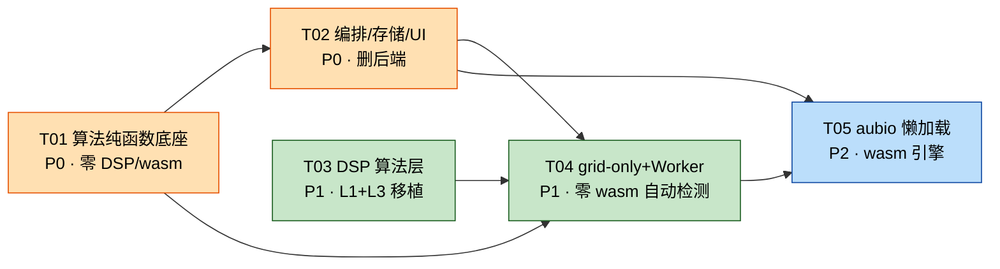

# 系统设计：节拍检测浏览器端化（纯静态零服务器）

> 版本 v1.0 ｜ 作者：Bob（Architect）｜ 输入：`docs/prd_browser_beat.md` v1.0 ｜ 状态：待工程实施
>
> 本文 = **Part A 系统设计** + **Part B 任务分解**，一份文档交付工程师。

---

## 0. 结论速览（TL;DR）

| 决策项 | 结论 |
|---|---|
| 音频抽取 | `OfflineAudioContext(1,1,22050).decodeAudioData(videoArrayBuffer)` → 多声道求均值降单声道。**主线程执行**（Web Audio 不暴露给 Worker） |
| 节拍检测架构 | **适配器 + 精调层分离**：`RawBeatDetector`（可插拔）+ `Refiner`（后端 1:1 移植，纯 TS 无 wasm） |
| 一期检测器 | `gridOnlyDetector`（**零 wasm**，ACF tempo seed + 梳状搜索），T04 交付即可自动检测 |
| 二期检测器 | `aubioDetector`（`aubiojs@0.2.1`，427KB 包 / 单线程 wasm / 懒加载），T05 接入，提供 raw tracked grid 以启用 grid-vs-raw 仲裁 |
| essentia.js | **不采用**（10.1MB 包，实测确认）。仅作为 aubio 精度不达标时的备选，且优先级低于「TS 版 Ellis DP tracker」 |
| ffmpeg.wasm | **P2 可选**。`@ffmpeg/core@0.12.10` 实测 **64.7MB unpacked**（wasm ~32MB）。做成动态 import + 可缺省依赖，不装也能 build |
| Worker | **必需**。DSP 全部在 Worker；**PCM 常驻 Worker**（transferable 零拷贝），`recompute(auto)` 直接复用 |
| comlink | **不采用**。协议只有 5 类消息且需要进度流 + abort，裸 `postMessage` 更简单、零依赖 |
| 数据契约 | `types/api.ts` **一字不改**；新增本地类型放 `src/types/local.ts` |
| 最早可用里程碑 | **T01 + T02**（手动 BPM / fixed120 均匀网格 + 8 拍切分 + 全 UI 打通），零 DSP、零 wasm |

---

# Part A：系统设计

## 1. 实现方案（Implementation Approach）

### 1.1 核心技术难点

| # | 难点 | 结论 |
|---|---|---|
| D1 | 浏览器解码视频音轨到 22050 Hz 单声道 | `decodeAudioData` 天然按 AudioContext 的 `sampleRate` 重采样 → 用 `OfflineAudioContext(1, 1, 22050)` 即可免费得到 22050 Hz。多声道用**算术平均**降单声道（对齐 librosa `mono=True`） |
| D2 | Web Audio API **不在 Worker 中暴露** | 解码必须留在主线程（`decodeAudioData` 本身是异步 + 浏览器内部线程，不阻塞 UI）；解码完的 `Float32Array` 以 **transferable** 移交 Worker |
| D3 | 后端 1456 行精调逻辑「移植到哪一层」（PRD Q1） | 见 §1.2 分层结论：**除 librosa 的 `beat_track`/`tempo` 外全部 1:1 移植**。这些精调逻辑（LSQ + 梳状拟合 + 吸附 + 八度纠正）**与检测库无关**，是后端精度的真正来源，且是纯数值 TS、可单测 |
| D4 | 绝对阈值常数在新 envelope 上是否仍然成立 | 逐条审计后（见 §1.4）：**所有绝对阈值都是无量纲比值或时域量**，对 envelope 的**幅度缩放免疫**，但对**形状**敏感 → 必须 1:1 移植 mel 前端（n_fft=2048 / n_mels=128 / Slaney-mel / power_to_db），并用**后端导出的黄金样本**做数值对拍 |
| D5 | JS 端 STFT 性能（5 分钟 @ hop 128 ≈ 5.2 万帧 × 2048 点 FFT） | 必须用 **实数 FFT（RFFT，N/2 复变换技巧）** + 预分配 TypedArray + 零 GC；全程在 Worker，带进度回调。性能预算见 §1.5 |
| D6 | 视频源刷新后 blob 失效 | `URL.createObjectURL` + **不存 Blob**；跨会话用「重选同一文件」+ `videoId` 校验。**`videoId` 哈希算法必须与现有 `Uploader.computeVideoId` 逐字节一致**，否则历史进度全部对不上 |
| D7 | `recompute(auto)` 需要已解码 PCM，但 transfer 会 detach 主线程 buffer | 让 **Worker 成为 PCM 的唯一持有者**（按 taskId 缓存）。主线程只留 `{sampleRate, duration}`。既满足「同会话复用」，又避免双份 26MB 内存 |

### 1.2 后端算法分层移植结论（回答 PRD Q1）

后端 `beat_detector.detect()` 可切成 3 层。**只有第 1 层依赖 librosa**：

| 层 | 后端实现 | 前端处置 | 理由 |
|---|---|---|---|
| **L1 前端特征**<br>`onset_strength`(hop256/hop128)、`onset_detect`、`_lowband_onset_env` | librosa | **自研 TS 移植**（`src/audio/dsp/*`） | 是确定性 DSP，无 JIT/无依赖，可用黄金样本逐点对拍 |
| **L2 原始拍点跟踪**<br>`librosa.beat.beat_track`（Ellis DP） | librosa | **可插拔适配器**：<br>① `gridOnlyDetector`（ACF tempo seed，无 raw grid）<br>② `aubioDetector`（aubio `Tempo`，产出 raw grid）<br>③（备选）TS 版 Ellis DP | 唯一「难以 1:1」的部分。做成接口 → 换库不影响 L3 |
| **L3 精调 / 仲裁 / 出参**<br>`_lsq_period_phase`、`_comb_search`、`_fit_uniform_grid`、`_grid_score`、snap、`_resolve_octave(_beats)`、`_recover_fast_*`、`_confidence`/`_grid_path_confidence`、BPM 求取 | 纯 numpy | **100% 1:1 移植**（`src/audio/gridFit|octave|fastRecovery|confidence|refineBeats.ts`） | **后端精度的绝大部分在这里**。纯数值、无副作用、可完整单测。移植代价 ≈ 400 行 TS |

> **关键判断**：PRD Q1 里 PM 说的「可选项」（低频带快速恢复、八度 F-measure 门控、raw+snap 回退）全部属于 L3，**移植代价远低于其价值**（它们各自都对应一个已修过的线上 Bug）。因此结论是：**L3 全做，不做删减**。真正的取舍点在 L2。

**L2 缺失 raw grid 的语义影响（必须写进代码注释）**：
`gridOnlyDetector` 没有 raw tracked grid，因此 `use_grid` 仲裁（`grid_score/raw_score >= 0.90 && cv(raw) <= 0.15`）退化为**恒真**，即永远走均匀网格路径。对本 App 的目标素材（定速编舞视频）这是安全的；对 accelerando / 串烧素材会劣化。`aubioDetector` 接入后仲裁恢复完整语义。

### 1.3 检测库选型对比（回答 PRD Q1 / Q8）

| 方案 | 包体积（npm 实测 unpackedSize） | 线程 | 产出 | 结论 |
|---|---|---|---|---|
| **`aubiojs@0.2.1`** | **427 KB** | 单线程 Emscripten | `Tempo` → raw 拍点 + BPM | ✅ **主选**（T05）。体积可接受、懒加载、专为 tempo/beat 设计 |
| `essentia.js@0.1.3` | **10.1 MB** | 单线程 | `RhythmExtractor2013` 质量最好 | ❌ 不采用。首屏/懒加载成本过高；且它同样不解决 8 拍网格均匀性（仍需 L3） |
| `web-audio-beat-detector@8.2.38` | 42 KB | 纯 JS | `(tempo, offset)` | ⚪ 备用「第二意见」。算法简单（低通+峰值），仅适合强底鼓素材，可作为 tempo seed 交叉校验 |
| **自研 TS（L1+L3 + ACF seed）** | 0 | — | 完整 | ✅ **一期主路径**（T03+T04）。零依赖、零首屏成本、离线绝对可用 |
| （备选）TS 版 Ellis DP tracker | 0 | — | raw grid | 🔶 若 aubio 实测不达标，**优先级高于换 essentia.js**（~200 行 vs 10MB） |

**wasm 懒加载策略**
1. 首屏 **不加载任何 wasm**。`src/audio/detectors/aubioDetector.ts` 内部用 `await import('aubiojs')`，由 Worker 在收到第一条 `ANALYZE` 消息时触发。
2. wasm 二进制用 `import wasmUrl from 'aubiojs/aubio.wasm?url'` 拿到同源 URL → `fetch` → `arrayBuffer` → `WebAssembly.instantiate`。**不用 `instantiateStreaming`**：CloudStudio 静态托管若未配置 `application/wasm` MIME 会直接失败。
3. 加载中主线程收到 `PROGRESS{stage:'engine_loading'}`，UI 显示「正在加载分析引擎（约 0.4 MB，仅首次）」。
4. 加载失败 → 自动回退 `gridOnlyDetector`，**不报错、不阻断**，仅在结果卡片上标注「已使用轻量检测」。

### 1.4 阈值常数迁移审计（D4 展开）

| 常数 | 性质 | 对 envelope 变化的敏感性 | 处置 |
|---|---|---|---|
| `GRID_SCORE_TOL=0.90` | 两个 grid 在**同一** envelope 上的比值 | 缩放免疫、形状容忍 | 直接沿用 |
| `GRID_MAX_CV=0.15` | 时域 IBI 变异系数 | 无关 | 直接沿用 |
| `SNAP_WINDOW=0.06`、`OCTAVE_TOL=0.07`、`OCTAVE_BAND_SLACK=0.02` | 秒 / 无量纲 | 无关 | 直接沿用 |
| `GRID_CONF_FLOOR_PCT=30` | 百分位 | 缩放免疫、**形状敏感** | 需 mel 前端 1:1 |
| `GRID_CONF_FULL_CONTRAST=5.0` | `mean(env' @beats)/mean(env')` 比值 | 缩放免疫、**形状敏感** | 需 mel 前端 1:1 + 黄金样本验证 |
| `OCTAVE_F_MARGIN=0.15` | F-measure 差值 | 缩放免疫、形状弱敏感 | 需黄金样本验证 |
| `LOW_MID_RATIO=0.55` | 低频带比值 | 缩放免疫 | 直接沿用（低频带用**线性幅度**，比 mel 好复现） |
| `LOW_MID_CONTRAST=8.0` | 低频带比值 | 缩放免疫 | 直接沿用 |
| `SLOW=70 / FAST=200 / RECOVER_CEIL=260 / DEFAULT_BPM=120 / LOW_CONF=0.6` | BPM 域 | 无关 | 直接沿用 |

> **强制验证手段**：写一次性脚本 `tools/dump_reference.py`（跑在现有 backend 上），对 3~5 支真实视频导出
> `{pcm_sha, sr, duration, env_track[], env_fine[], onset_times[], onset_w[], env_low[], raw_beats[], bpm, confidence, beat_times[], segments[]}`
> 到 `frontend/tests/fixtures/golden_*.json`。前端单测逐层比对：
> - `env_*` 皮尔逊相关系数 ≥ 0.98 且峰值位置偏差 ≤ 1 帧
> - `segments` **逐字段严格相等**（给定同一 `beat_times` 输入）
> - 端到端 `bpm` 相对误差 ≤ 2%、首拍偏差 ≤ 80 ms（PRD Q3 口径）
>
> 这是「1:1 语义移植」唯一可证伪的落地方式，**必须做**。

### 1.5 性能预算（5 分钟 / 22050 Hz / 单声道 = 6.62 M 采样 = 26.5 MB）

| 阶段 | 量级 | 预算（中端笔记本） | 说明 |
|---|---|---|---|
| `File.arrayBuffer()` | ~150 MB 视频 | 0.3–1 s | 主线程，异步 |
| `decodeAudioData` | → 26.5 MB PCM | 1–4 s | 主线程，浏览器内部线程解码，不阻塞 UI |
| transfer 到 Worker | 零拷贝 | < 5 ms | `postMessage(msg, [pcm.buffer])` |
| `onsetEnvelope` hop=256（2.6 万帧 × 2048 RFFT） | ~0.29 G flops | 1.5–3 s | Worker |
| `onsetEnvelope` hop=128（5.2 万帧 × 2048 RFFT） | ~0.58 G flops | 3–6 s | Worker |
| `lowBandEnvelope` hop=128（n_fft=1024，**懒建**） | ~0.26 G flops | 1–2 s | 仅候选轨道才付费 |
| `_comb_search` 粗+细（121×256 + 41×512，≈500 拍） | ~26 M 插值 | 0.3–0.8 s | Worker |
| snap / octave / confidence | O(n log n) | < 100 ms | Worker |
| **端到端合计** | | **7–17 s** | |

**验收阈值**：5 分钟视频端到端 ≤ 20 s，且进度条每 ≤ 1.5 s 前进一次。
**超标降级开关**（写进 `constants.ts`，默认关闭）：`FINE_ENV_NFFT: 2048 → 1024`（省一半 fine envelope 成本，代价是频率分辨率降低，需重跑黄金样本验证）。

### 1.6 架构模式

- **分层**：`UI (pages/components)` → `编排层 (api/localAnalysis + store/analysisStore)` → `Worker 协议层 (workers/*)` → `算法层 (audio/*)`
- **适配器模式**：`RawBeatDetector` 接口隔离 L2，wasm 库可热插拔
- **状态机**：`localAnalysis` 完全复刻后端 `TaskManager` 的对外契约（`TaskStatus` 结构 + 状态迁移），使 `AnalysisPage`/`LessonPage` 的消费代码改动最小
- **纯函数优先**：`segmenter` / `recompute` / `gridFit` / `octave` / `confidence` 全部无副作用，可脱离 DOM 与 Worker 单测

---

## 2. 文件列表（File List）

> 路径均相对仓库根。图例：🆕 新增 ｜ ✏️ 修改 ｜ ❌ 删除 ｜ 🔒 **禁止改动**

### 2.1 🆕 算法层 `frontend/src/audio/`

| 路径 | 职责 | 对应后端 |
|---|---|---|
| `src/audio/constants.ts` | 全部算法常数（ANALYSIS_SR / HOP_TRACK / HOP_FINE / GRID_* / SNAP_WINDOW / OCTAVE_* / LOW_* / RECOVER_CEIL_BPM / SLOW/FAST/DEFAULT_BPM / LOW_CONFIDENCE_THRESHOLD / MAX_* 限制） | `beat_detector.py` 头部 + `core/config.py` |
| `src/audio/decodeAudio.ts` | `decodeAudio(file, signal?)` → `{pcm, sampleRate, duration}`；OfflineAudioContext@22050 + 多声道均值降单；无音轨 / 全静音检测 | `audio_extractor.extract` |
| `src/audio/ffmpegFallback.ts` | ffmpeg.wasm 单线程降级封装（**动态 import，依赖可缺省**） | — |
| `src/audio/dsp/fft.ts` | radix-2 **实数 FFT**（N/2 复变换 + 后处理），预分配 buffer、零 GC | numpy/FFTW |
| `src/audio/dsp/stft.ts` | 分帧 + Hann 窗 + `center=True` 反射填充 + 幅度/功率谱 | `librosa.stft` |
| `src/audio/dsp/melFilter.ts` | Slaney mel 滤波器组（`n_mels=128, fmin=0, fmax=sr/2, htk=false, norm='slaney'`） | `librosa.filters.mel` |
| `src/audio/dsp/onsetEnvelope.ts` | `onsetStrength(pcm, sr, hop)` → mel 功率谱 → `power_to_db(ref=max, top_db=80)` → `max(0, S[t]-S[t-1])` → 跨 mel 带取均值 | `librosa.onset.onset_strength` |
| `src/audio/dsp/onsetPeaks.ts` | `onsetDetect(env, sr, hop)` peak-pick（`normalize` + `pre_max/post_max/pre_avg/post_avg/delta=0.07/wait`）；`onsetWeights` | `librosa.onset.onset_detect` + `_onset_weights` |
| `src/audio/dsp/lowBandEnvelope.ts` | 30–250 Hz **线性幅度** STFT（`n_fft=1024`）能量的半波整流一阶差分 | `_lowband_onset_env` |
| `src/audio/dsp/envSample.ts` | `envValueAt(env, sr, hop, times)` 线性插值采样（子帧精度） | `_env_value_at` |
| `src/audio/tempoSeed.ts` | onset envelope 自相关 + 对数正态 tempo 先验（中心 `DEFAULT_BPM=120`）→ 周期种子 | `librosa.beat.tempo` 的轻量等价 |
| `src/audio/gridFit.ts` | `lsqPeriodPhase` / `combSearch` / `fitUniformGrid` / `buildGrid` / `gridScore` | `_lsq_period_phase` `_comb_search` `_fit_uniform_grid` `_build_grid` `_grid_score` |
| `src/audio/octave.ts` | `nearestDistance` / `octaveFitness` / `bandTargetPeriod` / `resolveOctave` / `resolveOctaveBeats` / `densifyBeats` / `sparsifyBeats` / `octaveClamp` | 同名后端函数 |
| `src/audio/fastRecovery.ts` | `lowbandPeaks` / `midpointLowbandEvidence` / `midpointsAreBeats` / `recoverFastPeriod` / `recoverFastBeats` | 同名后端函数 |
| `src/audio/confidence.ts` | `confidenceFromIntervals` / `intervalCv` / `onsetContrast` / `gridPathConfidence` / `effectiveTempo` / `effectiveTempoMedian` | `_confidence` `_interval_cv` `_onset_contrast` `_grid_path_confidence` `_effective_tempo(_median)` |
| `src/audio/refineBeats.ts` | **精调编排** —— `detect()` 主体逻辑 1:1（仲裁 / snap / 八度 / 快速恢复 / BPM / confidence / 进度里程碑 50-60-75） | `beat_detector.detect` |
| `src/audio/detectors/types.ts` | `RawBeatDetector` 接口 + `RawTrackResult` | — |
| `src/audio/detectors/gridOnlyDetector.ts` | 零 wasm：`tempoSeed` → 无 raw grid（`rawBeats: null`） | — |
| `src/audio/detectors/aubioDetector.ts` | 懒加载 `aubiojs`，逐 hop 推 `Tempo` → raw 拍点 + tempo | `librosa.beat.beat_track` |
| `src/audio/beatDetect.ts` | 统一入口 `detectBeats(pcm, sr, opts)`：选检测器 → L1 特征 → `refineBeats` | — |
| `src/audio/segmenter.ts` | `segmentBeats(beatTimes, duration, beatsPerSegment=8)`（**含尾段规则**）/ `generateFixedBeats` / `generateFromFirstBeat` | `segmenter.py` 全文 |
| `src/audio/recompute.ts` | 四模式本地等价 `recomputeLocal(...)` | `TaskManager.recompute` |
| `src/audio/buildResult.ts` | `beatTimes + meta → AnalysisResult`（bpm 保留 2 位、`beatLowConfidence` 判定、`createdAt`） | `AnalysisTask.to_result` |

### 2.2 🆕 Worker 层 `frontend/src/workers/`

| 路径 | 职责 |
|---|---|
| `src/workers/protocol.ts` | 主线程 ⇄ Worker 消息类型定义（唯一真源，双端共享） |
| `src/workers/beat.worker.ts` | module worker：持有 PCM 缓存 + wasm 引擎；处理 `ANALYZE`/`RECOMPUTE`/`RELEASE`/`CANCEL`；回推 `PROGRESS`/`DONE`/`ERROR` |
| `src/workers/beatWorkerClient.ts` | 主线程封装：单例 Worker、requestId 路由、进度回调、`AbortSignal`、超时守卫（`max(60s, duration*3)`，对齐后端） |

### 2.3 🆕 编排 / 存储 / 工具

| 路径 | 职责 |
|---|---|
| `src/api/localAnalysis.ts` | **`apiClient` 的本地替身**：`startAnalysis(file)` / `getStatus(taskId)` / `getResult(taskId)` / `retry(taskId)` / `recompute(taskId, req)` / `release(taskId)`。返回类型与原 `apiClient` 完全一致 |
| `src/store/analysisStore.ts` | zustand：`tasks: Record<taskId, LocalTask>`（`TaskStatus` + `videoId` + `objectUrl` + `stageDetail` + `engineTag`）；订阅式驱动 UI |
| `src/storage/videoRegistry.ts` | `computeVideoId(file)`（**沿用现有 31 进制哈希，逐字节一致**）/ `registerObjectUrl` / `getObjectUrl` / `revokeObjectUrl`；`beforeunload` 统一回收 |
| `src/hooks/useLocalAnalysis.ts` | 订阅 `analysisStore`，导出与 `useAnalysisPolling` **同签名**的 `{status, error, loading, retry, cancel, stop}` |
| `src/utils/mediaValidate.ts` | 扩展名/MIME 校验、体积硬上限、时长软警告；返回 `{ok, code, message, level:'error'\|'warn'}` |
| `src/utils/errorCodes.ts` | 错误码 → 中文文案映射 + `toApiError(unknown): ApiError`（替代 `extractApiError`） |
| `src/types/local.ts` | 本地新增类型（`DecodedAudio` / `RawTrackResult` / `DetectResult` / `LocalTask` / `AnalysisStage`）。**`types/api.ts` 不动** |
| `src/components/EngineLoadingHint.tsx` | 「正在加载分析引擎（约 0.4 MB，仅首次）」 |
| `src/components/DetectFallbackPanel.tsx` | 检测失败兜底：「用 120 BPM 先切」/「手动填写 BPM」 |
| `src/components/ReselectVideoPanel.tsx` | 视频源失效：引导重选同一文件，`videoId` 比对 + 不一致警告 |

### 2.4 ✏️ 修改的现有文件

| 路径 | 改动 |
|---|---|
| `src/pages/UploadPage.tsx` | 去 `apiClient.warmup()` 与「正在唤醒服务器…」；标题「上传你的舞蹈视频」→「**选择你的舞蹈视频**」；副文案强调「视频不上传、全程本地处理」；`Uploader` 回调改为 `onSelected(file, videoId)` → `localAnalysis.startAnalysis` → `navigate('/analyze/:taskId')` |
| `src/components/Uploader.tsx` | **删除「视频链接」输入框 + `LinkIcon` + `url` state**（PRD Q5 已拍板）；删除 `http.post` 上传逻辑与上传进度条；限制文案改「支持 mp4 / webm / mov（建议 ≤5 分钟）」；`computeVideoId` 迁至 `videoRegistry` 后 re-export（**算法不变**） |
| `src/pages/AnalysisPage.tsx` | 数据源 `useAnalysisPolling` → `useLocalAnalysis`；步骤文案「接收视频」→「**读取文件**」、「检测节拍 (BPM)」→「**本地检测节拍 (BPM)**」；新增 `stageDetail` 副标题、取消按钮、`DetectFallbackPanel` |
| `src/pages/LessonPage.tsx` | ① `videoSrc`：`demoResult ? DEMO_VIDEO_URL : videoRegistry.getObjectUrl(videoId)`，为空则渲染 `ReselectVideoPanel`；② 结果来源三级回退（见 §4.3）；③ `apiClient.getResult/recompute` → `localAnalysis.*`；④ `extractApiError` → `toApiError`。**其余全部不动** |
| `src/pages/ProgressPage.tsx` | 卡片增加「需重新选择视频」角标（`getObjectUrl(vid)` 为空时）；跳转仍传 `{videoId}` |
| `src/hooks/useAnalysisPolling.ts` | ❌ 删除（被 `useLocalAnalysis` 取代） |
| `src/api/client.ts` | ❌ 删除 |
| `src/vite-env.d.ts` | 去 `VITE_API_BASE` |
| `frontend/vite.config.ts` | 去 `/api` proxy；加 `base: './'`、`worker: { format: 'es' }`、`optimizeDeps.exclude: ['aubiojs']`、`build.target: 'es2020'` |
| `frontend/package.json` | 去 `axios`；加 `aubiojs`（见 §6） |
| `frontend/README.md` | 去后端/axios/`VITE_API_BASE` 段落，补纯静态部署说明 |
| `frontend/tests/client.test.ts` | ❌ 删除 |
| `frontend/tests/uploadPage.test.tsx` | ✏️ 重写（warmup 断言失效 → 改断言「无 warmup、文案为『选择你的舞蹈视频』」） |
| `frontend/tests/uploader.test.tsx` | ✏️ 重写（URL 输入框已移除 → 改断言「不存在链接输入框」+ `onSelected` 回调） |
| `frontend/tests/qa_demoMode.test.tsx` | ✏️ 去掉 `vi.mock('../src/api/client')`，改 mock `localAnalysis` |

### 2.5 🔒 禁止改动（硬约束）

```
src/types/api.ts                     ← 数据契约，一字不改
src/store/lessonStore.ts
src/utils/segmentMath.ts             ← resegmentSegments / findBeatAt
src/utils/compare.ts  src/utils/voice.ts  src/utils/format.ts
src/hooks/useBeatSync.ts  usePlayPauseSync.ts  useVideoControls.ts  useLocalProgress.ts
src/components/VideoPlayer.tsx  BeatOverlay.tsx  SegmentList.tsx  ControlBar.tsx
src/components/LoopPanel.tsx  BeatInfoCard.tsx  CompareMode.tsx  ProgressHeader.tsx
src/demo/sampleLesson.ts             ← Demo 模式保留共存
```

### 2.6 后端处置

`backend/` **不删除、不再参与运行**。保留两个用途：① 黄金样本导出脚本 `backend/tools/dump_reference.py`（新增）；② 精度对照基线。构建与部署完全不涉及。

---

## 3. 数据结构与接口

### 3.1 复用契约（`src/types/api.ts` — 🔒 原样）

```ts
interface Segment      { index: number; startTime: number; endTime: number; type: string; beats: number[] }
interface AnalysisResult {
  taskId: string; videoName: string; bpm: number; confidence: number
  duration: number; createdAt: string; segments: Segment[]; beatLowConfidence?: boolean
}
type TaskStatusValue = 'queued'|'extracting'|'beat_detecting'|'segmenting'|'done'|'failed'
interface TaskStatus   { taskId: string; status: TaskStatusValue; progress: number
                         result: AnalysisResult | null; error: string | null }
type RecomputeMode     = 'auto'|'fixed120'|'fixedBpm'|'manual_first_beat'
interface RecomputeRequest { mode: RecomputeMode; firstBeatTime?: number; bpm?: number }
interface ApiError     { code: string; message: string; data: null }
```

### 3.2 新增本地类型（`src/types/local.ts`）

```ts
export interface DecodedAudio { pcm: Float32Array; sampleRate: number; duration: number }

/** L2 检测器产物。rawBeats 为 null 表示该检测器不提供 raw tracked grid。 */
export interface RawTrackResult { rawBeats: number[] | null; tempo: number; periodSeed: number }

export interface DetectResult { bpm: number; confidence: number; beatTimes: number[]; duration: number
                                usedGrid: boolean; engine: 'aubio' | 'grid-only' }

/** UI 细粒度阶段，仅用于副标题；不进入 TaskStatus（契约不可扩） */
export type AnalysisStage =
  | 'reading_file' | 'decoding' | 'engine_loading'
  | 'onset_envelope' | 'raw_tracking' | 'grid_fitting' | 'segmenting' | 'idle'

export interface LocalTask extends TaskStatus {
  videoId: string; videoName: string
  stage: AnalysisStage; stageDetail: string
  engine: 'aubio' | 'grid-only' | null
  cancelable: boolean
}
```

### 3.3 核心函数签名

```ts
// --- 解码（主线程） ---
export async function decodeAudio(file: File, signal?: AbortSignal): Promise<DecodedAudio>

// --- 检测（Worker 内） ---
export interface RawBeatDetector {
  readonly name: 'aubio' | 'grid-only'
  /** @param onProgress 0~1，映射到 beat_detecting 的 40→60 区间 */
  track(pcm: Float32Array, sr: number, envTrack: Float32Array,
        onProgress?: (p: number) => void): Promise<RawTrackResult>
}
export async function detectBeats(
  pcm: Float32Array, sampleRate: number,
  opts?: { detector?: RawBeatDetector; onProgress?: (pct: number) => void; signal?: AbortSignal },
): Promise<DetectResult>

// --- 切分（纯函数，1:1 移植 segmenter.aggregate） ---
export function segmentBeats(beatTimes: number[], duration: number, beatsPerSegment?: number): Segment[]
export function generateFixedBeats(duration: number, bpm?: number): number[]
export function generateFromFirstBeat(firstBeatTime: number, bpm: number, duration: number): number[]

// --- recompute 四模式（纯函数 + auto 需 Worker 侧 PCM） ---
export interface RecomputeCtx { duration: number; bpm: number
                                /** 仅 auto 模式需要；Worker 内提供 */
                                redetect?: () => Promise<DetectResult> }
export async function recomputeLocal(req: RecomputeRequest, ctx: RecomputeCtx)
  : Promise<{ beatTimes: number[]; bpm: number; confidence: number }>

// --- 结果构造 ---
export function buildResult(a: { taskId: string; videoName: string; bpm: number; confidence: number
  duration: number; beatTimes: number[]; forceConfident?: boolean }): AnalysisResult

// --- 本地 API（apiClient 替身） ---
export const localAnalysis: {
  startAnalysis(file: File): Promise<{ taskId: string; status: string }>
  getStatus(taskId: string): TaskStatus
  getResult(taskId: string): Promise<AnalysisResult>
  retry(taskId: string): Promise<{ taskId: string; status: string }>
  recompute(taskId: string, req: RecomputeRequest): Promise<AnalysisResult>
  cancel(taskId: string): void
  release(taskId: string): void
}

// --- videoId（算法禁止改动） ---
export function computeVideoId(file: File): string   // `v${hash31(`${name}:${size}:${lastModified}`)>>>0}`
```

### 3.4 Worker 消息协议（`src/workers/protocol.ts`）

```ts
type ToWorker =
  | { type:'ANALYZE';   id:string; taskId:string; pcm:Float32Array; sampleRate:number; duration:number; preferWasm:boolean }
  | { type:'RECOMPUTE'; id:string; taskId:string; req:RecomputeRequest; currentBpm:number }
  | { type:'CANCEL';    id:string }
  | { type:'RELEASE';   taskId:string }

type FromWorker =
  | { type:'PROGRESS'; id:string; status:TaskStatusValue; progress:number; stage:AnalysisStage; detail:string }
  | { type:'DONE';     id:string; payload:{ bpm:number; confidence:number; beatTimes:number[]; duration:number; engine:string } }
  | { type:'ERROR';    id:string; code:string; message:string }
```

> `ANALYZE` 的 `pcm.buffer` 通过 transferable 移交；**Worker 成为 PCM 唯一持有者**并按 `taskId` 缓存，`RECOMPUTE{mode:'auto'}` 直接复用，`RELEASE` 时释放。

### 3.5 类图

见 `docs/class-diagram.mermaid`。

---

## 4. 程序调用流程

完整时序见 `docs/sequence-diagram.mermaid`。以下为关键衔接点说明。

### 4.1 主流程：选择文件 → 练习

1. `Uploader` 选中文件 → `computeVideoId(file)` → `onSelected(file, videoId)`
2. `UploadPage` → `mediaValidate(file)`（error 阻断 / warn 弹确认）→ `localAnalysis.startAnalysis(file)`
3. `localAnalysis`：`crypto.randomUUID()` 生成 `taskId` → `videoRegistry.registerObjectUrl(videoId, URL.createObjectURL(file))` → `analysisStore` 落 `{status:'queued', progress:0}` → 立即 return（**非阻塞，复刻后端 202 语义**）
4. 后台链：`decodeAudio(file)`（`extracting` 10→35）→ `beatWorkerClient.analyze(pcm ⇢ transfer)`（`beat_detecting` 40→75）→ `segmentBeats`（`segmenting` 80）→ `buildResult`（`done` 100）
5. `AnalysisPage` 订阅 `analysisStore`；`status==='done'` → `navigate('/lesson/:taskId', {state:{videoId}})`
6. `LessonPage`：`result` 来源见 §4.3；`videoSrc = getObjectUrl(videoId)`；其后 **`resegmentSegments` / `findBeatAt` / `useBeatSync` / `lessonStore` 全链路完全不变**

### 4.2 recompute 本地等价流

| mode | 是否需要 Worker | 流程 |
|---|---|---|
| `fixed120` | 否 | `generateFixedBeats(duration, 120)` → `bpm=120, confidence=1.0` |
| `fixedBpm` | 否 | 范围校验（越界抛 `BPM 需在 40–300 之间`）→ `generateFixedBeats(duration, bpm)` → `confidence=1.0` |
| `manual_first_beat` | 否 | `generateFromFirstBeat(firstBeatTime, currentBpm||120, duration)`；**bpm 不变** |
| `auto` | 是 | Worker `RECOMPUTE` → 取 `taskId` 的缓存 PCM → `detectBeats` → 新 `bpm/confidence`；无缓存则抛 `NO_AUDIO_CACHE` |

四种模式统一收尾（1:1 复刻 `TaskManager.recompute` 尾部）：
```
segments = segmentBeats(beats, duration)
beatLowConfidence = false ; status = 'done' ; progress = 100 ; error = null
```

### 4.3 结果来源三级回退（跨会话恢复，回答 PRD Q2）

```
LessonPage 取 result：
  1) location.state.demoResult                       → Demo 模式（原样保留）
  2) analysisStore.tasks[taskId].result              → 同会话
  3) useLocalProgress.getCourse(videoId).result      → 跨会话（localStorage/IndexedDB 已有）
  4) 都没有 → 错误页「课程数据已丢失，请重新选择视频」

LessonPage 取 videoSrc：
  1) Demo → DEMO_VIDEO_URL
  2) videoRegistry.getObjectUrl(videoId)             → 同会话
  3) 无 → 渲染 <ReselectVideoPanel>（不跳走、不清进度）
        用户重选文件 → computeVideoId(newFile) === videoId ?
          ✅ 一致 → registerObjectUrl → 原地继续（已学会小节、beatOffset 全部保留）
          ⚠️ 不一致 → 提示「这似乎不是同一个视频」+「仍然使用」二次确认
```

> **不存视频 Blob**（团队已拍板）。IndexedDB 只承载 `useLocalProgress` 现有的 `result` + 进度，schema **不变**。

### 4.4 状态机与进度映射（复刻 PRD §4.5）

| status | progress | stage（副标题） | 触发点 |
|---|---|---|---|
| `queued` | 0 | `reading_file` /「读取文件…」 | `startAnalysis` 返回 |
| `extracting` | 10 → 35 | `decoding` /「解码音频…」 | `decodeAudio` 开始 → 完成 |
| `beat_detecting` | 40 | `engine_loading` /「加载分析引擎…」 | 仅 wasm 路径首次 |
| `beat_detecting` | 50 | `onset_envelope` /「分析音频能量…」 | ← 后端 `progress_callback(50)` |
| `beat_detecting` | 60 | `raw_tracking` /「跟踪拍点…」 | ← 后端 `progress_callback(60)` |
| `beat_detecting` | 75 | `grid_fitting` /「校准节拍网格…」 | ← 后端 `progress_callback(75)` |
| `segmenting` | 80 | `segmenting` /「按 8 拍分段…」 | |
| `done` | 100 | `idle` | |
| `failed` | 0 | `idle` | `error` 带中文原因 |

**进度单调不回退**：`analysisStore` 写入时取 `max(prev.progress, next.progress)`（`retry`/`queued` 显式重置除外）。

---

## 5. 尚不明确 / 需要注意（Anything UNCLEAR）

见 §10「待明确事项」。以下为**已做的假设**，若与实际不符需回头调整：

| 假设 | 依据 | 若不成立的影响 |
|---|---|---|
| `OfflineAudioContext` 可构造为 22050 Hz 且 `decodeAudioData` 会重采样到该速率 | W3C Web Audio 规范；Chrome/Safari/Firefox 均实现 | 需在解码后自行做多相重采样（+1 个模块） |
| `decodeAudioData` 能吃 mp4/mov(AAC)、webm(Opus/Vorbis) 的**完整视频文件** ArrayBuffer | Chrome/Safari 实测良好；Firefox 对 mp4-AAC 依赖平台解码器 | 触发 ffmpeg.wasm 降级或直接进手动 BPM |
| `aubiojs@0.2.1` 的 `Tempo` 绑定可拿到逐 hop 的拍点时间 | 包体 427 KB，含 Tempo/Onset/Pitch 绑定 | 改用 TS 版 Ellis DP tracker（T05 备选） |
| CloudStudio 静态托管为 HTTPS（`getUserMedia` 可用） | team-lead 已确认 | `CompareMode` 静默失效 |
| librosa 版本为 0.10.x（`onset_strength` 默认参数） | 需工程师核对 `backend/requirements*` | mel 前端参数需按实际版本对齐 |

---

# Part B：任务分解

## 6. 依赖包列表（Required Packages）

### 6.1 新增

```bash
cd frontend
npm i aubiojs@^0.2.1
```

| 包 | 版本 | 体积（npm unpackedSize 实测） | 用途 | 何时加载 |
|---|---|---|---|---|
| `aubiojs` | `^0.2.1` | **427 KB**（wasm ≈ 200 KB） | L2 raw beat tracker | **懒加载**，用户选完文件后由 Worker 动态 import |

### 6.2 移除

```bash
npm rm axios          # apiClient 下线后无其它使用点（已全仓 grep 确认）
```

### 6.3 可选 / 暂不安装（P2，需 team-lead 二次确认后再装）

| 包 | 版本 | 体积 | 说明 |
|---|---|---|---|
| `@ffmpeg/ffmpeg` + `@ffmpeg/core` | `0.12.15` / `0.12.10` | **72 KB + 64.7 MB**（wasm ≈ 32 MB） | 解码降级路径。体积是 aubio 的 **150 倍**，且必须自托管（用默认 CDN 会破坏「离线可用」）。**建议先用真实素材实测 `decodeAudioData` 失败率，>5% 再引入** |
| `web-audio-beat-detector` | `^8.2.38` | 42 KB | tempo 交叉校验「第二意见」，纯 JS 无 wasm |
| `essentia.js` | `0.1.3` | **10.1 MB** | ❌ 不建议。见 §1.3 |

### 6.4 明确不引入

- **`comlink`**：协议仅 5 类消息且需要进度流 + abort + transferable，裸 `postMessage` 更直观且零依赖。
- **任何多线程 wasm**：CloudStudio 静态托管无 COOP/COEP 响应头，`SharedArrayBuffer` 不可用（团队已锁定）。
- **任何 FFT npm 包**：`dsp/fft.ts` 自研 ~150 行实数 FFT，避免为 3 KB 代码引入不可控依赖，且需要精确控制 buffer 复用以满足性能预算。

---

## 7. 任务列表（有序 / 依赖 / 可并行标注）

> 编号 T01–T05 与 §0 TL;DR 一致。
> **最早可用里程碑 = T01 + T02**：零 DSP、零 wasm，手动 BPM / `fixed120` / 8 拍切分 + 全 UI 打通即可交付。
> **自动检测里程碑 = T03 + T04**：零 wasm 也能自动出节拍（`gridOnlyDetector` 走 ACF tempo seed）。
> **增强里程碑 = T05**：接入 aubio wasm 引擎，启用 grid-vs-raw 仲裁。

### 7.1 总览表

| ID | 任务名 | 依赖 | 可并行 | 优先级 | 交付标志（验收） |
|---|---|---|---|---|---|
| **T01** | 算法纯函数底座（切分 / recompute / 结果构造 / 常数） | — | ✅ **与 T03 完全并行** | P0 | `segmentBeats` / `generateFixedBeats` / `generateFromFirstBeat` / `recomputeLocal` / `buildResult` 单测通过（尾段规则生效） |
| **T02** | 编排 / 存储 / 错误码 / 全 UI 打通（删后端） | T01（仅签名） | ✅ **可先以桩 detector 与 T03 并行起步** | P0 | 手动 BPM / `fixed120` 全流程跑通；`apiClient`/`useAnalysisPolling`/`/api` 调用全部删除 |
| **T03** | DSP 算法层（L1 特征 + L3 精调，自研 FFT/STFT/mel） | — | ✅ **与 T01 完全并行** | P1 | 黄金样本逐层对拍通过（env 皮尔逊 ≥0.98，segments 逐字段相等） |
| **T04** | `gridOnlyDetector` + Worker 集成（零 wasm 自动检测） | T01, T02, T03 | ❌ 收口任务 | P1 | 选文件 → 自动出 8 拍网格，bpm 来自 ACF seed，状态机完整 |
| **T05** | `aubioDetector` 懒加载接入（wasm 引擎） | T04 | ❌ 需 T04 先通 | P2 | 首次分析自动加载 aubio；失败静默回退 grid-only，结果卡片标注 |

### 7.2 任务明细

**T01 · 算法纯函数底座（P0，零 DSP / 零 wasm）**
- 源文件：`src/audio/constants.ts`、`src/audio/segmenter.ts`、`src/audio/recompute.ts`、`src/audio/buildResult.ts`、`src/types/local.ts`（先建 `DecodedAudio`/`DetectResult`/`RawTrackResult`/`LocalTask`/`AnalysisStage`）。
- 内容：`segmentBeats`（**含尾段不足 8 拍也发出**，对齐 `segmenter.py.aggregate`）、`generateFixedBeats`、`generateFromFirstBeat`；`recomputeLocal` 四模式（纯函数分支，auto 的 `redetect` 由调用方注入）；`buildResult`（bpm 保留 2 位、confidence 判定、`createdAt`）。
- 验收：纯函数单测（含尾段边界、BPM=120 网格均匀性、`resegmentSegments` 兼容性）。

**T02 · 编排 / 存储 / 错误码 / 全 UI 打通（P0，删后端）**
- 源文件：`src/api/localAnalysis.ts`、`src/store/analysisStore.ts`、`src/storage/videoRegistry.ts`、`src/utils/errorCodes.ts`、`src/utils/mediaValidate.ts`、`src/hooks/useLocalAnalysis.ts`、`src/workers/protocol.ts`（类型）、`src/workers/beatWorkerClient.ts`（**桩**：能 post `ANALYZE` 但 detector 暂用常量占位）、`src/pages/UploadPage.tsx`、`src/components/Uploader.tsx`、`src/pages/AnalysisPage.tsx`、`src/pages/LessonPage.tsx`、`src/pages/ProgressPage.tsx`、`src/components/ReselectVideoPanel.tsx`、`src/components/DetectFallbackPanel.tsx`；**删除** `src/api/client.ts`、`src/hooks/useAnalysisPolling.ts`；**改** `frontend/vite.config.ts`（去 `/api` proxy、加 `base:'./'`、`worker.format:'es'`）、`frontend/package.json`（去 `axios`）、`src/vite-env.d.ts`、`frontend/README.md`；**改测试** `uploadPage.test.tsx` / `uploader.test.tsx` / `qa_demoMode.test.tsx`。
- 内容：`localAnalysis` 复刻 `apiClient` 对外签名（非阻塞 `startAnalysis` 复刻 202 语义）；`analysisStore` 按 `taskId` 索引 `LocalTask`，进度 `max(prev,next)`；`videoRegistry.computeVideoId` **逐字节沿用**旧 `Uploader` 31 进制哈希；三级回退接线；删除全部 `http.post` / `VITE_API_BASE` 引用。
- 验收：手动 BPM / `fixed120` 完整走通；`grep -r "apiClient\.\|/api/v1\|useAnalysisPolling" src` 无残留；Demo 模式不受影响。

**T03 · DSP 算法层（P1，L1 + L3 纯 TS 1:1 移植）**
- 源文件：`src/audio/dsp/{fft,stft,melFilter,onsetEnvelope,onsetPeaks,lowBandEnvelope,envSample}.ts`、`src/audio/tempoSeed.ts`、`src/audio/{gridFit,octave,fastRecovery,confidence}.ts`、`src/audio/refineBeats.ts`；`backend/tools/dump_reference.py`（**新增**，黄金样本导出）；`frontend/tests/fixtures/golden_*.json`（由脚本产出）；`frontend/tests/dsp.*.test.ts`。
- 内容：自研实数 RFFT（预分配、零 GC）；mel 前端 1:1（`n_fft=2048 / n_mels=128 / Slaney / power_to_db`）；L3 精调（LSQ+梳状+吸附+八度+快速恢复+双路径 confidence）**不删减**，对应已修过的线上 Bug。
- 验收：黄金样本逐层对拍（见 §9.7）；性能预算（§1.5）。

**T04 · `gridOnlyDetector` + Worker 集成（P1，零 wasm 自动检测）**
- 源文件：`src/audio/detectors/types.ts`、`src/audio/detectors/gridOnlyDetector.ts`、`src/audio/beatDetect.ts`（统一入口）、`src/workers/beat.worker.ts`（真实接 `detectBeats` + `gridOnlyDetector` + `refineBeats`，持 PCM 缓存）、`src/workers/beatWorkerClient.ts`（真实实现替换 T02 桩）。
- 内容：`gridOnlyDetector` 用 `tempoSeed` → `rawBeats: null`（无 raw grid，仲裁退化为恒真，安全于定速素材）；`beat.worker` 处理 `ANALYZE`/`RECOMPUTE`/`CANCEL`/`RELEASE`，回推 `PROGRESS`/`DONE`/`ERROR`；`recompute(auto)` 直接复用 Worker 内 PCM 缓存。
- 验收：选文件 → 自动出 8 拍网格；状态机与 §4.4 完全一致；`recompute(auto)` 不重复解码。

**T05 · `aubioDetector` 懒加载接入（P2，wasm 引擎）**
- 源文件：`src/audio/detectors/aubioDetector.ts`、`src/audio/ffmpegFallback.ts`（可选 P2）、`src/components/EngineLoadingHint.tsx`、`src/workers/beat.worker.ts`（加 wasm 加载分支）、`src/components/DetectFallbackPanel.tsx`（增强）、`frontend/package.json`（加 `aubiojs`）。
- 内容：`aubioDetector` 在 `ANALYZE` 时 `await import('aubiojs')`，wasm 二进制走 `arrayBuffer` 路径（不用 `instantiateStreaming`，规避 MIME 风险）；加载失败 → 自动回退 `gridOnlyDetector`，不报错、不阻断，仅结果卡片标注「已使用轻量检测」。
- 验收：首次分析自动加载 aubio（约 0.4 MB，仅首次）；失败路径回退正常；aubio 精度达 §9.7 口径（否则走 §10 D2 决策）。

### 7.3 并行收益说明

```
T01 ─────────────┐
                  ├─→ T04 ─→ T05
T03 ─────────────┘
T02（先桩 detector）──┘        （T02 仅依赖 T01 类型签名，可与 T03 并行；
                                 真实检测待 T04 收口后接入）
```
- **T01 与 T03 完全无依赖**，可双线并行（纯函数底座 vs DSP 内核）。
- **T02 可先用「常量占位 detector」推进 UI**，不必等 T03/T04，待 T04 收口后替换。
- **T04 是唯一收口任务**，必须等 T01+T02+T03。
- **T05 必须等 T04**（L2 可插拔替换 + UI 兜底面板已在 T02 就位）。

---

## 8. 任务依赖图（Mermaid）



> 图例：橙色 = P0（最早里程碑），绿色 = P1，蓝色 = P2。T01∥T03 可并行；T02 可先桩后接。

---

## 9. 共享知识（跨任务统一约定）

> 工程师实施 T01–T05 时，**所有跨任务一致的口径都在此处**，避免各任务各自发挥导致契约漂移。

### 9.1 videoId 生成规则（🔒 算法不可变）

```ts
function computeVideoId(file: File): string {
  const raw = `${file.name}:${file.size}:${file.lastModified}`;
  let h = 0;
  for (let i = 0; i < raw.length; i++) h = (h * 31 + raw.charCodeAt(i)) | 0;
  return `v${h >>> 0}`;
}
```
- 迁移后 `Uploader.computeVideoId` 必须**逐字节一致**地迁到 `videoRegistry.computeVideoId`（只改位置，不改算法），否则历史进度全部对不上。
- `taskId` 用 `crypto.randomUUID()` 生成（每次新分析唯一），与 `videoId` **解耦**：`analysisStore` 按 `taskId` 索引，`videoId` 仅作字段；跨会话恢复走 `videoId`。

### 9.2 AnalysisResult 本地构造约定（`buildResult`）

| 字段 | 约定 |
|---|---|
| `bpm` | `Number(bpm.toFixed(2))`（保留 2 位，对齐后端） |
| `confidence` | detector 输出；`fixed120`/`fixedBpm` 恒 `1.0`；`manual_first_beat` 沿用上一次 |
| `beatLowConfidence` | `confidence < LOW_CONFIDENCE_THRESHOLD(0.6)`（同后端）；`fixed*` 模式强制 `false` |
| `createdAt` | `new Date().toISOString()` |
| `duration` | 解码得到的 `duration`（秒，浮点） |
| `segments` | `segmentBeats(beatTimes, duration)` 产出，**尾段不足 8 拍也必须发出** |
| `taskId` | 传入的本地 `taskId`（≠ videoId） |

### 9.3 进度状态机（复刻后端 `TaskStatus` + §4.4）

- 对外**必须是 `TaskStatus` 结构**（`status`/`progress`/`result`/`error`），使 `AnalysisPage`/`LessonPage` 消费代码改动最小。
- 迁移路径：`queued(0) → extracting(10→35) → beat_detecting(40→75) → segmenting(80) → done(100)`，任一段转 `failed`。
- **单调不回退**：`analysisStore` 写入取 `max(prev.progress, next.progress)`（`retry`/`queued` 显式重置）。
- **超时守卫**：`beatWorkerClient` 设 `timeout = max(60_000, duration*1000*3)`，对齐后端 `task_manager._run_pipeline`；超时 → `ERROR{ANALYSIS_TIMEOUT}`。

### 9.4 错误码 → 中文文案映射（`toApiError`）

| code | 触发 | 中文 message |
|---|---|---|
| `DECODE_FAILED` | `decodeAudioData` 抛错 / 无音轨 / 全静音 | 「无法读取该视频的音频，请换一个文件或手动填写 BPM」 |
| `NO_AUDIO_CACHE` | `recompute(auto)` 时 Worker 无该 `taskId` 的 PCM | 「需要重新分析后才能自动重测，请先回到分析页」 |
| `ANALYSIS_TIMEOUT` | 超时守卫触发 | 「分析耗时过长，已自动停止，可重试或改用 120 BPM」 |
| `BPM_OUT_OF_RANGE` | `fixedBpm` 的 bpm 不在 40–300 | 「BPM 需在 40–300 之间」 |
| `NO_BEATS` | `detectBeats` 产出空拍点 | 「未能检测到节拍，请尝试手动填写 BPM」 |
| `ENGINE_LOAD_FAILED` | aubio wasm 加载失败 | （不阻断）自动回退轻量检测，结果卡片标注「已使用轻量检测」 |
| `MEDIA_TOO_LARGE` | 文件 > `MAX_FILE_MB(500)` | 「文件过大（上限 500 MB）」 |
| `UNKNOWN` | 其它 | 「处理出错：<原始 message>」 |

`toApiError(e): ApiError` 统一把任意异常转成 `{code, message, data:null}`，取代旧 `extractApiError`。

### 9.5 recompute 四模式语义约束（复刻 `task_manager.recompute`）

| mode | 是否需 Worker | 行为 |
|---|---|---|
| `fixed120` | 否 | `generateFixedBeats(duration, 120)`，`bpm=120, confidence=1.0`，`beatLowConfidence=false` |
| `fixedBpm` | 否 | 范围校验（越界抛 `BPM_OUT_OF_RANGE`），`generateFixedBeats(duration, bpm)`，`confidence=1.0` |
| `manual_first_beat` | 否 | `generateFromFirstBeat(firstBeatTime, currentBpm||120, duration)`，**bpm 不变**，confidence 沿用 |
| `auto` | 是 | Worker `RECOMPUTE` 取 `taskId` 缓存 PCM → `detectBeats` → 新 `bpm/confidence`；无缓存抛 `NO_AUDIO_CACHE` |

**四模式统一收尾**：`segments = segmentBeats(beats, duration)`、`beatLowConfidence = false`、`status = 'done'`、`progress = 100`、`error = null`。

### 9.6 跨会话恢复约定（三级回退，见 §4.3）

- **结果**：`demoResult` → `analysisStore`(同会话) → `useLocalProgress.getCourse(videoId)`(跨会话) → 错误页。
- **视频源**：`Demo→DEMO_VIDEO_URL`；否则 `videoRegistry.getObjectUrl(videoId)`；为空渲染 `ReselectVideoPanel`，重选文件 `computeVideoId(newFile)===videoId` 则原地继续（已学小节 / `beatOffset` 全保留），不一致则二次确认。
- **不存视频 Blob**；IndexedDB 仅承载 `useLocalProgress` 现有 `result`+进度，schema 不变。

### 9.7 验收口径（PRD Q3，T03/T05 必须达标）

- 端到端 `bpm` 相对误差 ≤ 2%；首拍偏差 ≤ 80 ms。
- **黄金样本**：env 皮尔逊相关系数 ≥ 0.98 且峰值位置偏差 ≤ 1 帧；`segments` **逐字段严格相等**。
- 5 分钟视频端到端 ≤ 20 s，进度每 ≤ 1.5 s 前进一次。
- 算法不变量：`60 / median(diff(beatTimes)) ≈ bpm`（§4.4）。

---

## 10. 待明确事项（仅限需 team-lead / PM 拍板）

> 已锁定的产品决策（decodeAudioData 优先、ffmpeg 降级、aubio 优先禁多线程、wasm 懒加载、BPM≤2%/首拍≤80ms、手动 BPM P0、createObjectURL+videoId 重选、砍 URL 入口、5min 软警告、recompute auto 复用、CloudStudio HTTPS）**不再在此列出**。以下为仍待决的点：

**D1 · ffmpeg.wasm 是否在一期安装**（P2 决策点）
现状：`decodeAudioData` 在 Chrome/Safari 实测良好，Firefox 对 mp4-AAC 依赖平台解码器。建议先用 10–20 支真实素材实测失败率，**>5% 才引入**（包体 64.7 MB，需自托管，会削弱「离线可用」）。需 team-lead 确认：① 触发阈值是否取 5%；② 若引入，是否接受自托管 wasm 二进制（不能用默认 CDN）。

**D2 · aubio 精度兜底策略**
若 `aubiojs` 实测相对误差 >2% 或首拍 >80ms：决策在「接受 `gridOnlyDetector` 作为最终方案」与「投入 ~200 行 TS 版 Ellis DP tracker」之间。需 PM 对「可接受最低精度」拍板；架构已保证 L2 可插拔，两种方案都不影响 L3。

**D3 · 引擎切换是否暴露给用户**
默认设计：自动（aubio 优先，失败静默回退 grid-only）。是否需要在 UI 提供「轻量引擎 / 精确引擎」手动切换？若需要，`EngineLoadingHint` 与 `DetectFallbackPanel` 需扩展。建议默认不暴露，待用户反馈再定。

**D4 · 黄金样本生成的前置环境**（非决策，提请注意）
`backend/tools/dump_reference.py` 需在现有 backend 环境（librosa 0.10.x）运行导出 `golden_*.json`，作为前端单测基线。需 team-lead 协调一次「跑后端脚本 + 提交 fixtures」，否则 T03 的验收（§9.7）无法闭环；如 librosa 版本非 0.10.x，mel 前端参数需按实际版本对齐（见 §5 假设）。

> 以上 4 条是真正还需拍板的；其余均已在 PRD / 本次设计中锁定。

---

*文档结束。配套图：`docs/class-diagram.mermaid`（类图）、`docs/sequence-diagram.mermaid`（时序图）。*
