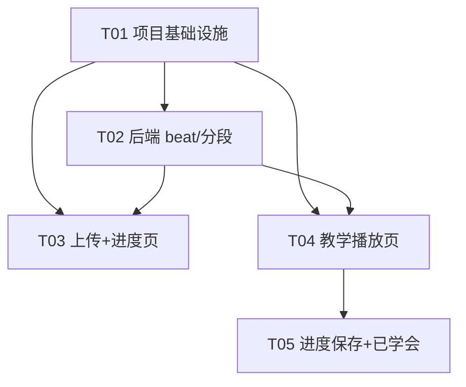

# 舞蹈教学网站 · 系统架构设计与任务拆解（规划阶段 v0.1）

> 架构师：高见远 ｜ 阶段：仅规划，先设计后实现，不含实现代码
> 配套文件：`docs/class-diagram.mermaid`（类图）、`docs/sequence-diagram.mermaid`（时序图）
> 依据：PRD v0.1（产品经理：许清楚）

---

## 第一部分：系统设计

### 1. 实现方案与框架选型

#### 1.1 整体架构与本地运行方式

采用**三层轻量架构**，全部本地可运行、不依赖重云服务（符合 PRD「本地优先」）：

- **前端 SPA**：React 18 + Vite + MUI + Tailwind CSS，纯浏览器运行，Phase1 零注册。
- **后端 API**：Python FastAPI + Uvicorn，本地进程，负责音频提取、beat 检测、8 拍分段。
- **本地存储**：localStorage + IndexedDB，Phase1 保存学习进度与「已学会」标记。

**部署与 How to Run**

```
# 后端（终端 1）
cd backend
python -m venv .venv && source .venv/bin/activate
pip install -r requirements.txt
# 系统需预装 ffmpeg（mac: brew install ffmpeg / ubuntu: apt install ffmpeg）
uvicorn app.main:app --reload --port 8000

# 前端（终端 2）
cd frontend
npm install
npm run dev        # Vite dev server，默认 http://localhost:5173
```

- 前端通过环境变量 `VITE_API_BASE=/api/v1` 指向后端；开发期用 Vite `proxy`（`/api` → `http://localhost:8000`）或后端 `CORSMiddleware` 处理跨域（推荐二者并存，见 §8 待明确2）。
- 生产（可选）：`vite build` 产出静态文件，由 FastAPI 用 `StaticFiles` 托管，单端口部署。

#### 1.2 beat 检测技术路线（产品技术核心）

处理链路：**视频 → 提取音频(wav) → BPM 估计 → 节拍点检测 → 按 8 拍聚合为小节 → 结构化 JSON**

1. **音频提取** `app/services/audio_extractor.py`
   调用系统 `ffmpeg`（subprocess）从视频分离音轨，统一导出 **16kHz / mono / 16bit wav**。librosa 虽能直接 `load(mp4)`，但 ffmpeg 对 mov/webm 兼容性更稳，且便于后续转码与时长校验。
2. **BPM 估计 + 节拍点检测** `app/services/beat_detector.py`（核心用 librosa）
   - `y, sr = librosa.load(wav, sr=16000, mono=True)`
   - `tempo, beats_frames = librosa.beat.beat_track(y=y, sr=sr, units='frames')` —— 同时返回 BPM（存在倍频歧义）与 beat 帧位置。
   - `beat_times = librosa.frames_to_time(beats_frames, sr=sr)` —— 转成秒级时间戳数组。
   - **置信度**：用节拍间隔稳定性代理估算 `confidence`（如 inter-beat interval 的变异系数越小越稳）；若 librosa 版本直接提供 plp 置信度则优先使用。范围 0~1。
3. **8 拍聚合** `app/services/segmenter.py`
   将 `beat_times`（每拍一个时间戳）每 **8 个** 为一小节（舞蹈「8-count」惯例 = 2 个 4/4 小节）：
   - `segment[i].startTime = beat_times[8*i]`
   - `segment[i].endTime = beat_times[8*i+8]`（最后一节用 `min(duration, beat_times[-1] + 0.5*avg_beat_interval)`）
   - `segment[i].beats = beat_times[8*i : 8*i+8]`（固定长度 8 的拍点时间戳）
   - `index` 从 **1** 开始；`type` 默认 `"dance"`，预留 `"intro"|"break"`（P1-2 智能跳过用）。
4. **结构化返回**：见 §3 `AnalysisResult`。

**为何 librosa 可达 ≥90% 准确率（指标1）**
- K-pop / 短视频热门舞多为**稳定 4/4 拍**，BPM 恒定，`beat_track` 在稳定节拍上 F-measure 通常 0.85~0.95。
- 时长约束：短视频 ≤2 分钟、整舞 ≤3 分钟、≤500MB。librosa 处理 3 分钟 16kHz 单声道音频在本地 CPU 上通常 **数秒~十几秒**，远低于 3 分钟上限。
- 风险与兜底（采纳 PRD 待确认1）：
  - **BPM 倍频/半频错误**（如 120 误判 60/240）→ 8 拍聚合整体错位。策略：估计 BPM<70 或 >200 时按 2 倍/0.5 倍修正；`confidence<0.6` 时返回低置信并在前端让用户三选一「自动 / 固定 120BPM / 手动标第一拍」。
  - **间奏/变速段落** beat 不稳 → Phase1 不做智能跳过（留 P1-2），但 schema 预留 `type` 字段。

#### 1.3 前端节拍叠加同步机制（关键设计点）

核心命题：把后端返回的「真实时间轴拍点」与 `<video>` 播放进度对齐，做到「播放到某拍 → 画面叠加对应 1..8 计数 + 脉冲」。

- **数据**：`result.segments[].beats` 为各拍的**真实秒级时间戳**，与视频 timeline 同坐标系。
- **驱动源**：用 `requestAnimationFrame` 轮询 `video.currentTime`（**不**用 `timeupdate` 事件——后者粒度约 250ms，不足以精确踩拍）。rAF 提供 ~16ms 精度，足够。
- **定位当前小节**：`segment = segments.find(s => currentTime >= s.startTime && currentTime < s.endTime)`。
- **计算当前拍号**：在 `segment.beats` 中找 `last beat <= currentTime`，其下标 +1 = `beatIndex`（1..8）。
- **脉冲触发**：维护 `prevTime`，当某拍 `beatT` 满足 `prevTime < beatT <= currentTime` 时，触发一次 200~300ms 缩放/辉光动画（`BeatOverlay`）。用「越过」而非「等于」判断，避免慢放/快进漏拍。
- **seek 处理**：拖动进度条后 `prevTime` 重置为当前 `currentTime`，重新计算 `segment` 与已过拍，避免脉冲错乱。
- **慢放不影响拍点对齐**：`video.playbackRate = 0.5` 只改变播放速度，`currentTime` 仍按真实时间流逝；beat 时间戳是真实时间轴 → 叠加逻辑不变，脉冲自然随慢放变慢，正好满足「跟着慢放学」。
- **单节循环**：rAF 检测 `currentTime >= segment.endTime` 时 `video.currentTime = segment.startTime`（循环开关开启时）。
- **双机位正/背切换**：`cameraAngle` 状态切换 `video.src` 或叠加层；单角度仅提供镜像（PRD 待确认4）。

#### 1.4 镜像 / 慢放 / 循环用 `<video>` 原生能力

- **镜像翻转**：`VideoPlayer` 外层 `div` 加 `style={{ transform: 'scaleX(-1)' }}`，由 `mirror` 状态控制，**默认 `true`**（单角度模拟舞室镜面）。
- **慢放**：`video.playbackRate = 0.5 | 0.75 | 1`（浏览器普遍支持 0.5x）。
- **单节循环**：见 §1.3，rAF clamp 回 `startTime`；不依赖 `<video loop>`（那只能整段循环）。
- **进度条拖动**：MUI `Slider` 绑定 `currentTime`，拖动即 `video.currentTime = value`（seek）。

### 2. 文件列表及相对路径

```
dance_teacher_web/
├── backend/                         # FastAPI 后端（音视频分析）
│   ├── app/
│   │   ├── main.py                  # FastAPI 实例、CORS、路由挂载、静态托管
│   │   ├── core/
│   │   │   └── config.py            # 配置：文件/时长上限、CORS、临时目录
│   │   ├── routers/
│   │   │   ├── upload.py            # POST /api/v1/upload（本地/链接）
│   │   │   └── analysis.py          # GET 状态、GET 结果、POST 重试
│   │   ├── services/
│   │   │   ├── audio_extractor.py   # ffmpeg 提取 wav
│   │   │   ├── beat_detector.py     # librosa BPM/beat 检测
│   │   │   ├── segmenter.py         # 8 拍聚合
│   │   │   └── task_manager.py      # 异步任务状态机（内存 + 落盘 json）
│   │   ├── schemas/
│   │   │   └── analysis.py          # Pydantic：UploadResp/TaskStatus/AnalysisResult/Segment
│   │   ├── models/
│   │   │   └── task.py              # 任务数据模型
│   │   └── utils/
│   │       └── video.py             # 时长/格式校验、链接下载转码
│   └── requirements.txt             # fastapi, uvicorn, librosa, numpy, python-multipart, ffmpeg-python ...
│
├── frontend/                        # React SPA
│   ├── index.html
│   ├── package.json
│   ├── vite.config.ts
│   ├── tailwind.config.js
│   ├── postcss.config.js
│   ├── tsconfig.json
│   └── src/
│       ├── main.tsx                 # 入口
│       ├── App.tsx                  # 路由根（react-router）
│       ├── index.css                # Tailwind 指令 + 全局样式
│       ├── types/
│       │   └── api.ts               # 前后端共享类型（AnalysisResult/Segment/...）
│       ├── api/
│       │   └── client.ts            # axios 封装 + 类型安全
│       ├── store/
│       │   └── lessonStore.ts       # 教学页状态（zustand）
│       ├── hooks/
│       │   ├── useBeatSync.ts       # ★节拍同步核心：rAF + currentTime → beatIndex + pulse
│       │   ├── useVideoControls.ts  # playbackRate/镜像/循环状态
│       │   ├── useAnalysisPolling.ts# 轮询分析状态
│       │   └── useLocalProgress.ts  # localStorage/IndexedDB 进度读写
│       ├── components/
│       │   ├── Uploader.tsx         # 上传组件（进度+重试）
│       │   ├── SegmentList.tsx      # 左栏小节列表
│       │   ├── VideoPlayer.tsx      # 播放器封装（镜像/慢放/循环）
│       │   ├── BeatOverlay.tsx      # 节拍计数 + 脉冲叠加
│       │   ├── ControlBar.tsx       # 速度/循环/镜像/口令控件
│       │   └── ProgressHeader.tsx   # 进度头（x/N 小节）
│       ├── pages/
│       │   ├── UploadPage.tsx       # 上传页
│       │   ├── AnalysisPage.tsx     # 分析进度页
│       │   ├── LessonPage.tsx       # 教学播放页（核心）
│       │   └── ProgressPage.tsx     # 个人进度页（课程列表/统计雏形）
│       └── utils/
│           └── format.ts            # 时间格式化等
│
└── docs/                            # 规划文档（本交付）
    ├── system_design.md
    ├── class-diagram.mermaid
    └── sequence-diagram.mermaid
```

**Phase2 文件边界（本轮不实现，仅预留接口与目录）**
- 后端：`app/services/pose_estimator.py`（MediaPipe/BlazePose 骨骼关键点 + 相似度打分）。
- 前端：`src/pages/PracticePage.tsx`、`src/components/PoseFeedback.tsx`（摄像头接入 + 打分展示）。
- 后端账户：`app/routers/auth.py`、`app/services/sync.py`（P2-1 跨设备同步）。

### 3. 数据结构与接口（API Schema）

**通用约定**：时间单位统一为**秒（浮点）**；节拍索引从 **1** 开始；8 拍一小节；错误响应统一 `{code, message, data:null}`。

#### 3.1 核心 API

| 方法 | 路径 | 说明 | 请求 | 响应 |
|---|---|---|---|---|
| POST | `/api/v1/upload` | 上传视频（本地文件 multipart 或 `{url}` 链接）| `Form(file)` 或 `{url}` | `{taskId, status}` |
| GET | `/api/v1/analysis/{taskId}` | 查询任务状态 + 进度（含 result 当 done）| — | `TaskStatus` |
| GET | `/api/v1/analysis/{taskId}/result` | 取分析结果（status=done 时）| — | `AnalysisResult` |
| POST | `/api/v1/analysis/{taskId}/retry` | 失败重试 | — | `{taskId, status}` |

状态机：`queued → extracting → beat_detecting → segmenting → done` / `failed`。前端轮询 `GET /analysis/{taskId}`，`progress` 为 0~100；`done` 后自动进入教学页。

#### 3.2 AnalysisResult JSON Schema（示例）

```json
{
  "taskId": "a1b2c3d4-0001",
  "videoName": "kpop_demo.mp4",
  "bpm": 120.5,
  "confidence": 0.92,
  "duration": 158.3,
  "createdAt": "2026-07-24T22:15:00Z",
  "segments": [
    {
      "index": 1,
      "startTime": 0.0,
      "endTime": 4.0,
      "type": "dance",
      "beats": [0.0, 0.5, 1.0, 1.5, 2.0, 2.5, 3.0, 3.5]
    },
    {
      "index": 2,
      "startTime": 4.0,
      "endTime": 8.0,
      "type": "dance",
      "beats": [4.0, 4.5, 5.0, 5.5, 6.0, 6.5, 7.0, 7.5]
    }
  ]
}
```

> 注：120 BPM → 每拍 0.5s，8 拍 = 4s，节拍计数 1..8 对应 `beats` 数组下标 0..7。

Pydantic 概要（后端 `schemas/analysis.py`）：

```python
class Segment(BaseModel):
    index: int                 # 1-based
    startTime: float           # 秒
    endTime: float             # 秒
    type: str = "dance"        # dance | intro | break（预留）
    beats: list[float]         # 长度 8，每拍时间戳（秒）

class AnalysisResult(BaseModel):
    taskId: str
    videoName: str
    bpm: float
    confidence: float          # 0~1
    duration: float
    createdAt: str
    segments: list[Segment]

class TaskStatus(BaseModel):
    taskId: str
    status: str                # queued|extracting|beat_detecting|segmenting|done|failed
    progress: int              # 0~100
    result: AnalysisResult | None = None
    error: str | None = None
```

#### 3.3 前端本地进度存储结构（localStorage / IndexedDB）

存储 key：`dance-teacher:progress:v1`

```json
{
  "version": 1,
  "courses": {
    "<videoId>": {
      "videoName": "kpop_demo.mp4",
      "taskId": "a1b2c3d4-0001",
      "result": { "...AnalysisResult..." },
      "progress": {
        "currentSegment": 1,
        "playbackRate": 1,
        "mirror": true,
        "loopSegment": false,
        "voiceEnabled": false,
        "learnedSegments": [1, 2],
        "updatedAt": "2026-07-24T22:20:00Z"
      }
    }
  }
}
```

- `videoId`：本地文件用 `content hash(file)`，链接用 `hash(url)`，保证同一视频复用进度。
- `result` 一般 < 50KB，存 localStorage 安全；若超阈值由 `useLocalProgress` 自动降级到 IndexedDB（调用方无感）。
- **断点续学**：进入 `LessonPage` 先读 `progress.currentSegment` 自动跳转；标记「已学会」写回 `learnedSegments`。

### 4. 程序调用流程（时序图）

完整 Mermaid 见 `docs/sequence-diagram.mermaid`，包含两张图：
- **图① 上传 → beat 检测/分段 → 前端轮询 → 教学页**：用户上传 → `POST /upload` 返回 taskId → `TaskManager` 后台 `extracting→beat_detecting→segmenting→done` → `AnalysisPage` 每 ~1s 轮询直到 done → 自动跳 `LessonPage` 拉取 `AnalysisResult` 渲染。
- **图② 播放时 currentTime 驱动节拍叠加（运行时）**：`VideoPlayer` 播放 → `useBeatSync` 每帧 rAF 读 `currentTime` → 定位 segment 与 beatIndex → `BeatOverlay` 渲染 1..8；每帧检测「越过某拍」触发 `pulse`；循环开启且越过 `endTime` 则回跳 `startTime`。

### 5. 任务列表（有序、含依赖）

按系统硬性上限拆为 **5 个模块任务**（每个任务含 ≥3 个相关文件，按功能层分组），Phase1 完整、可独立交付；Phase2 仅列路线。详见第二部分 §7。

### 6. 依赖包列表

**前端**
- `react@^18.2` / `react-dom@^18.2`：UI 框架
- `@mui/material@^5` + `@emotion/react` + `@emotion/styled`：组件库
- `tailwindcss@^3` + `postcss` + `autoprefixer`：原子化样式
- `react-router-dom@^6`：页面路由
- `axios@^1`：HTTP 调用（或原生 fetch）
- `zustand@^4`：轻量状态管理（`lessonStore`）
- `vite@^5` + `@vitejs/plugin-react`：构建/DevServer

**后端**
- `fastapi@^0.110`：Web 框架
- `uvicorn[standard]@^0.29`：ASGI 服务器
- `librosa@^0.10`：BPM / beat 检测（**核心**）
- `numpy@^1.26`：数值计算
- `python-multipart@^0.0.9`：文件上传
- `ffmpeg-python@^0.2`：调用 ffmpeg 提取音频（或 subprocess 直调 ffmpeg CLI）
- `pydantic@^2` / `pydantic-settings`：Schema 与配置
- `soundfile@^0.12`：wav 读写（librosa 依赖）

**可选 / Phase2**
- `mediapipe@^0.10`（姿态识别）、`opencv-python`（视频帧）、`scikit-learn`（相似度）

### 7. 共享知识（跨文件约定）

- **时间**：统一「秒」、浮点；视频时间轴与 beat 时间戳同坐标系。
- **节拍**：8 拍 = 1 小节（舞蹈 8-count，=2 个 4/4 小节）；索引从 **1** 开始；每小节 `beats` 固定长度 8。
- **字段命名**：传输层 JSON 用 **snake_case**（前后端一致，避免 camel/snake 转换）；前端 TS 类型同名复用。
- **错误码**：统一 `{code, message, data}`；HTTP 4xx/5xx + 业务 code（如 `FILE_TOO_LARGE`、`UNSUPPORTED_FORMAT`、`BEAT_LOW_CONFIDENCE`、`TASK_FAILED`）。
- **视频限制**：≤500MB、≤10 分钟、格式 mp4/webm/mov（见 `core/config.py`）。
- **进度 key**：`dance-teacher:progress:v1`，结构见 §3.3。
- **ID 规则**：`taskId` = UUID；`videoId` = 内容 hash。
- **状态轮询间隔**：前端 `useAnalysisPolling` 固定 1000ms。

### 8. 待明确事项（架构层待拍板）

| # | 待拍板点 | 推荐默认 |
|---|---|---|
| 1 | 超大/超长视频转码策略 | 超出上限直接拒绝并提示「请裁剪或分阶段」；不做云端转码（本地优先）|
| 2 | 跨域方案 | 开发期 Vite proxy `/api`→8000；生产期 FastAPI `CORSMiddleware` 放行前端源 |
| 3 | 异步任务落盘 | Phase1 单用户本地，`TaskManager` 用内存 + json 文件即可；多用户再加 sqlite |
| 4 | Phase2 姿态相似度算法 | BlazePose 33 关键点 → 关节角余弦相似度 + DTW 时序对齐，先原型验证 |
| 5 | beat 低置信度兜底交互 | 前端弹「自动 / 固定 120BPM / 手动标第一拍」三选一（采纳 PRD 待确认1）|
| 6 | 链接视频下载与版权 | 上传页声明「仅个人学习、不外传」；后端下载转码后不持久化源文件 |

---

## 第二部分：任务拆解

### 7. 任务列表（按依赖排序，≤5 个模块任务）

> 规则：每个任务 ≥3 个相关文件、按功能/层次分组；第一个任务为「项目基础设施」；任务数硬上限 5（符合架构规范）。Phase2 仅列路线，不计入本轮实现。

**T01 — 项目基础设施**（Phase1 / P0，依赖：无，优先级：P0）
- Source Files：`backend/requirements.txt`、`backend/app/main.py`、`backend/app/core/config.py`、`frontend/package.json`、`frontend/vite.config.ts`、`frontend/tailwind.config.js`、`frontend/postcss.config.js`、`frontend/tsconfig.json`、`frontend/index.html`、`frontend/src/main.tsx`、`frontend/src/App.tsx`、`frontend/src/index.css`、`frontend/src/types/api.ts`、`frontend/src/api/client.ts`
- Dependencies：无
- Priority：P0
- 验收：前后端可分别启动；前端能 `GET /api/v1/health`；`types/api.ts` 与 `client.ts` 就绪（含 `AnalysisResult` 类型）；Tailwind+MUI 可用。

**T02 — 后端 beat 检测与 8 拍分段服务**（Phase1 / P0，依赖：T01，优先级：P0）
- Source Files：`backend/app/routers/upload.py`、`backend/app/routers/analysis.py`、`backend/app/services/audio_extractor.py`、`backend/app/services/beat_detector.py`、`backend/app/services/segmenter.py`、`backend/app/services/task_manager.py`、`backend/app/schemas/analysis.py`、`backend/app/models/task.py`、`backend/app/utils/video.py`
- Dependencies：T01
- Priority：P0
- 验收：上传 ≤3 分钟视频，返回 `segments` 经人工抽检 10 段准确率 ≥90%；`bpm`/`confidence` 正确；状态机可轮询；失败可 `retry`。

**T03 — 上传页 + 分析进度页**（Phase1 / P0，依赖：T01、T02，优先级：P0）
- Source Files：`frontend/src/pages/UploadPage.tsx`、`frontend/src/pages/AnalysisPage.tsx`、`frontend/src/components/Uploader.tsx`、`frontend/src/hooks/useAnalysisPolling.ts`
- Dependencies：T01, T02
- Priority：P0
- 验收：能上传本地/链接视频，显示文件名/大小/进度与四步状态；失败可重试；`done` 自动跳 `LessonPage`。

**T04 — 教学播放页核心**（Phase1 / P0，依赖：T01、T02，优先级：P0）
- Source Files：`frontend/src/pages/LessonPage.tsx`、`frontend/src/components/SegmentList.tsx`、`frontend/src/components/VideoPlayer.tsx`、`frontend/src/components/BeatOverlay.tsx`、`frontend/src/components/ControlBar.tsx`、`frontend/src/hooks/useBeatSync.ts`、`frontend/src/hooks/useVideoControls.ts`、`frontend/src/store/lessonStore.ts`
- Dependencies：T01, T02
- Priority：P0
- 验收：小节列表点击跳转+高亮；0.5/0.75/1x 慢放；单节循环；节拍 1..8 计数+脉冲与视频同步（rAF 驱动）；镜像默认开；「下一节」按钮可用。

**T05 — 进度保存与已学会标记**（Phase1 / P0，依赖：T01、T04，优先级：P0）
- Source Files：`frontend/src/hooks/useLocalProgress.ts`、`frontend/src/pages/ProgressPage.tsx`、`frontend/src/components/ProgressHeader.tsx`、`frontend/src/utils/format.ts`
- Dependencies：T01, T04
- Priority：P0
- 验收：进度自动存 localStorage，重开回到 `currentSegment`；标记「已学会」反映到列表与进度页；断点续学保存率 100%。

**Phase2 路线（不实现，仅列）**
- T06 摄像头跟练打分：`pose_estimator.py` + `PracticePage.tsx` + `PoseFeedback.tsx`（P1-5 / US-10）
- T07 账户与跨设备同步：`auth.py` + `sync.py`（P2-1）
- T08 社区/课程库（P2-2 / P2-3）
- T09 AI 动作纠错细粒度反馈（P2-4）
- T10 移动端 App/摄像头适配（P2-5）

### 8. 任务依赖图（Mermaid）



---

> 交付说明：本文档为规划阶段架构设计，未包含任何实现代码，可直接交工程师排期。技术核心（beat 检测 → 8 拍分段 → 前端节拍叠加同步）已在 §1.2 / §1.3 与 `sequence-diagram.mermaid` 图②讲透。
